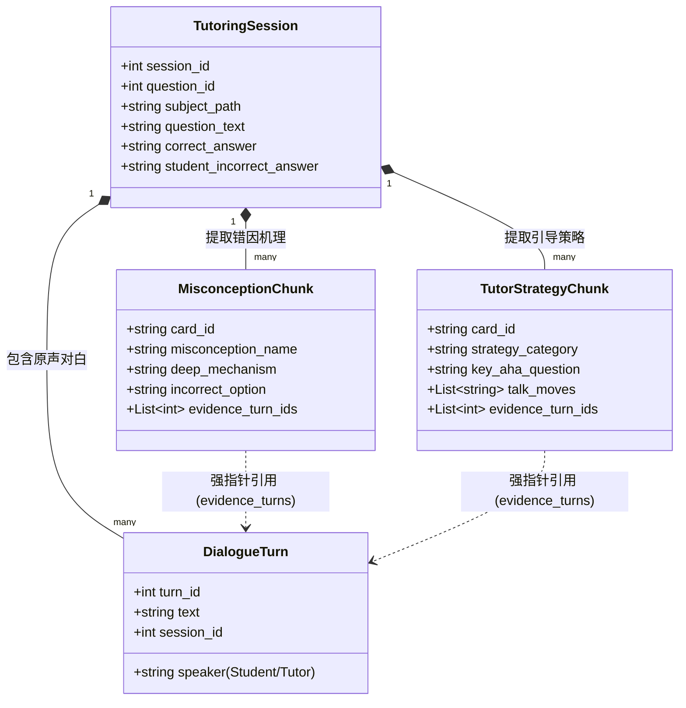
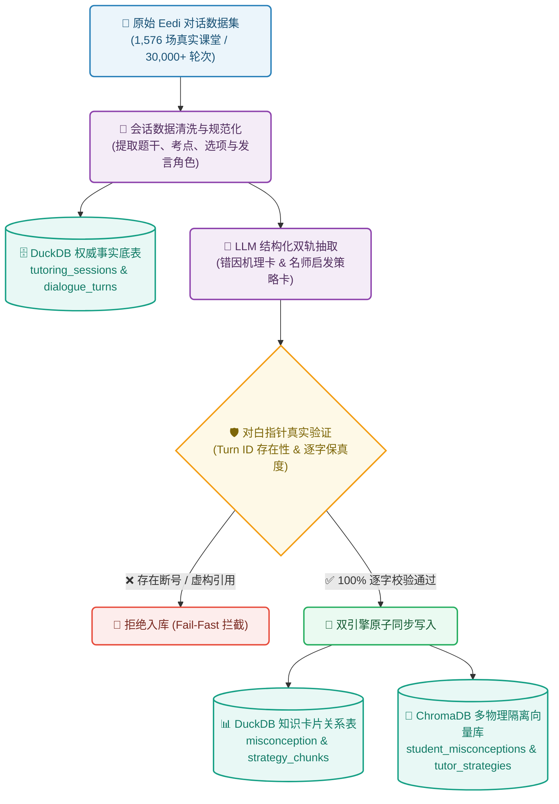
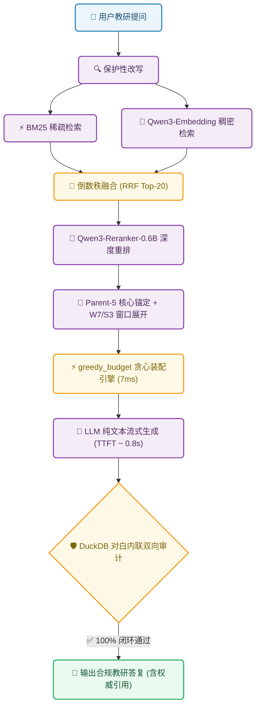

# Eedi-RAG: 基于真实多轮师生对白的教学诊断与启发式引导检索增强生成系统

> **项目定位**：面向 K12 数学教育场景的垂直领域 RAG（Retrieval-Augmented Generation）系统。通过深入挖掘数千场真实师生辅导对白，构建包含**“学生学情障碍/错因机理”**与**“名师启发式提问/脚手架”**的双轨知识资产，提供具备证据权威追溯、严格引用闭环与毫秒级上下文装配能力的智能教研问答系统。

[](https://www.python.org/)
[-brightgreen.svg)]()
[]()
[]()
[]()
[]()

---

## 目录
- [一、项目背景与业务诉求](#一项目背景与业务诉求)
- [二、数据来源与知识工程建模](#二数据来源与知识工程建模)
- [三、系统架构与核心技术框架](#三系统架构与核心技术框架)
- [四、整体程序数据流图](#四整体程序数据流图)
- [五、量化评测体系与优化基线指标](#五量化评测体系与优化基线指标)
- [六、快速开始与使用指南](#六快速开始与使用指南)
- [七、工程诚信与真实性守则](#七工程诚信与真实性守则)

---

## 一、项目背景与业务诉求

### 1.1 业务痛点与出发点
在职业教育与中小学辅导机构中，随着线上教学的推进，沉淀了海量导师与学生之间一对一真实辅导的课堂文字实录（Tutoring Transcripts）。这些非结构化长篇口语记录属于典型的**“沉睡高价值资产”**：
- **痛点一（非结构化长篇口语）**：人工无法逐篇阅读成千上万场包含数十轮碎语、犹豫、反复确认的口语记录；
- **痛点二（传统教研断层）**：资深名师的教学方法论（如遇到卡壳时的通俗比喻、破局提问步骤）停留在个案中，难以被新晋教师批量借鉴与传承；
- **痛点三（学情盲区）**：学生在关键概念上的共性**认知误区（Misconceptions）**无法系统化沉淀，导致教材编写与备课解析缺乏真实学情数据支撑。

### 1.2 核心业务使命
项目的根本使命是：**以“从小做起、低成本快速验证（PoC）”为准则，利用 AI/LLM 与先进 RAG 技术盘活这批多轮辅导文字稿，将口语对白转化为高结构化的教学洞察与可交互的问答引擎。**

系统必须能够可靠回答两类核心业务问题：
1. **学生端（学情与错因洞察）**：
   - 某考点下学生最容易产生哪些深层认知障碍与混淆？
   - 学生在做题时出现典型的错误选项（如误选 A），其背后的思维误区究竟是什么？
2. **导师端（教学法与启发策略）**：
   - 经验丰富的名师如何运用**苏格拉底式提问（Socratic Questioning）**引导学生自我察觉？
   - 遇到抽象概念时，名师使用了哪些逐步引导的**教学脚手架（Scaffolding）**和**破局一问（Key Aha Question）**？

### 1.3 对话型 RAG 的特殊技术挑战
与常规的“图书/文档 RAG”不同，本场景面临三大极其严苛的工程挑战：
- **角色与意图强分离**：对话中混杂着“学生的错误推导”与“导师的正确引导”。系统必须在切片与检索层严格隔离，**绝不能把学生的错误认知当成标准答案返回**；
- **多轮时序上下文锚定**：口语切片（如“我知道了”、“选 B 对吗”）脱离上下文毫无语义。切片必须与原题题干、考点知识点、前后多轮交互逻辑绑定为一个原子知识单元；
- **零幻觉与内联对白强引用**：系统输出的任何教研建议与错因诊断，必须强制回溯到底层真实原声对白（Turn ID 与逐字原话），严禁大模型凭空捏造知识卡片。

---

## 二、数据来源与知识工程建模

### 2.1 数据源与数据集概况
本项目基于 Hugging Face 公开权威的教育教研对白数据集：  
👉 [**Eedi/Question-Anchored-Tutoring-Dialogues-2k**](https://huggingface.co/datasets/Eedi/Question-Anchored-Tutoring-Dialogues-2k)

| 数据维度 | 全量规模 | 说明 |
|---|:---:|---|
| **会话总数 (Sessions)** | **1,576 场** | 覆盖全量真实 K12 在线 1v1 师生辅导实录 |
| **对白总轮数 (Dialogue Turns)** | **30,000+ 轮** | 时序原声多轮问答，标注学生（Student）与导师（Tutor）角色 |
| **题目覆盖 (Question IDs)** | 数百道精选考题 | 覆盖代数、几何、分数、负数、概率、四舍五入等核心初等数学知识点 |
| **题目元数据完整度** | 100% | 每场会话均完整包含：原题题干、选项 A/B/C/D、正确选项、学生初始错误选项 |

### 2.2 双轨知识卡片抽取与建模
系统将非结构化长对话离线提炼为**错因卡**与**策略卡**双轨结构化知识单元，并严格绑定底层权威对话指针：



---

## 三、系统架构与核心技术框架

Eedi-RAG 采用生产级工业解耦架构，主要由五大核心子系统组成：

```
┌─────────────────────────────────────────────────────────────────────────┐
│                           Eedi-RAG 核心子系统架构                          │
├───────────────────┬─────────────────────────────────────────────────────┤
│ 1. 双引擎分层存储   │ DuckDB (关系底表与权威审计) + ChromaDB (物理隔离向量集合)│
├───────────────────┼─────────────────────────────────────────────────────┤
│ 2. 多路混合检索   │ BM25 (精准专业词) + Qwen3-Embedding (1024d 稠密) + RRF   │
├───────────────────┼─────────────────────────────────────────────────────┤
│ 3. 深度语义重排   │ Qwen3-Reranker-0.6B Cross-Encoder (Top-15/20 候选池) │
├───────────────────┼─────────────────────────────────────────────────────┤
│ 4. 锚定逻辑窗口装配│ Parent-5 锚点 + Window-7/Stride-3 展开 + greedy_budget (7ms)│
├───────────────────┼─────────────────────────────────────────────────────┤
│ 5. 严格生成契约   │ Pydantic 强类型门禁 + 对白内联双向闭环审计 + LLM 流式输出  │
└───────────────────┴─────────────────────────────────────────────────────┘
```

### 3.1 双引擎分层存储底座 (Dual Storage Layer)
- **关系底表引擎 (DuckDB)**：
  - 承载不可篡改的会话事实底表（`tutoring_sessions`）与全量对白轮次（`session_dialogue_turns`）；
  - 提供毫秒级按 `(session_id, turn_id)` 快速回溯原始逐字对白、说话人角色与数学公式。
- **语义向量引擎 (ChromaDB)**：
  - 构建多物理隔离集合：`student_misconceptions`（学情错因集合）、`tutor_strategies`（名师策略集合）、`fallback_windows`（原文冷备滑动窗口）；
  - 统一采用 `Qwen/Qwen3-Embedding-0.6B (1024d)` 向量契约，彻底杜绝多模型混用的维度与语义污染。

### 3.2 多路混合召回与深度重排 (Hybrid Retrieval & Reranker)
- **保护性查询改写 (Protected Token Preservation)**：保留题目数学符号、题号与考点术语，防止意图漂移；
- **BM25 + 稠密向量融合 (RRF)**：
  - BM25 负责命中题干专有数字、方程式与特定术语；
  - Qwen3-Embedding 捕捉“学生为什么在这里卡壳”等语义层面的深层意图；
  - 通过倒数秩融合（Reciprocal Rank Fusion, RRF）合并生成初筛候选。
- **Cross-Encoder 语义精排 (Qwen3-Reranker-0.6B)**：
  - 实测召回容差（Recall Tolerance）实验表明：将初筛池规模定为 Top-15/20，可在确保 **96.67% ~ 100% 黄金证据无一遗漏** 的前提下，将重排卡片 Top-5 精度提升 24%。

### 3.3 9.7 突破性创新：锚定逻辑窗口与极速贪心装配器
在处理真实长对话时，单卡片碎片容易导致大模型断章取义，而传统组合背包算法在多切片时又会导致指数级超时。为此，我们在 9 月 7 日重构并落地了创新装配器：
1. **Parent-5 卡片锚定**：锁定重排得分前 5 的核心卡片，并将其 `source_turn_ids` 作为对话逻辑锚点；
2. **Window-7 / Stride-3 逻辑窗口展开**：前后向各拓展 3 轮师生交互（覆盖 7 轮连续对白），完整保留学生暴露误区与导师启发翻转的关键转折；
3. **确定性贪心算法 (`greedy_budget`)**：
   - 彻底废除原组合搜索与动态规划，按语义打分贪心装填；
   - 引入子集快速判重剪枝与 4000 Token 动态预算门禁；
   - **装配延迟从原先的 8,178 ms 降至 7.25 ms（极速提升 1,128 倍），且实现 0 Token 越界违规。**

### 3.4 严格生成契约与证据审计护栏 (Generator Contract & Citation Audit)
大模型必须在严格的工程护栏下输出：
- **Pydantic 强契约输出**：严格结构化包含思维链、学情障碍诊断、破局一问、内联引用标号；
- **对白内联闭环审计 (Citation Audit)**：
  - 凡是在正文中引用的标号（如 `[E01]` 或 `[Turn 4]`），底层审计模块必须在 DuckDB 中 100% 核实其真实存在且逐字匹配；
  - 若存在凭空捏造引述、角色张冠李戴（把学生说的话标为导师）或引用上下文未提供的内容，系统立即抛出 `CitationAuditError` 并拦截伪造输出；
- **流式输出与 TTFT 纳秒级度量**：支持首字延迟（TTFT）与各阶段（检索、重排、装配、推理）耗时的细粒度分析。

---

## 四、整体程序数据流图

系统按照模块化工程思想设计，整体全景架构涵盖**终端接入层**、**查询治理网关**、**离线知识工程流水线**、**核心多路检索与 9.7 极速装配引擎**、**契约生成与对白双向审计**、**双引擎分层存储底座**以及**自动化评测控制面**七大子系统。

<p align="center">
  
</p>

### 4.1 核心数据流转阶段说明

1. **终端交互与查询治理 (Top)**：
   - 业务教研人员通过 Web 看板或交互式 CLI (`scripts/interactive_cli.py`) 输入自然语言问题；
   - 查询治理网关执行**保护性实体识别与改写**，100% 保护数学方程式、题号等关键实体，防止检索语义漂移。
2. **离线知识抽取与指针校验 (Left)**：
   - 离线全量摄取 1,576 场 Eedi 课堂对话，提取题干、考点与 Student/Tutor 发言；
   - LLM 抽取**错因机理卡**与**名师启发策略卡**，并对每一张卡片的 `evidence_turn_ids` 执行**底层逐字指针强校验（Fail-Fast 门禁）**，通过后原子同步至 DuckDB 关系表与 ChromaDB 向量库。
3. **核心多路检索与 9.7 贪心装配 (Center)**：
   - **双路并行召回**：BM25 稀疏检索（抓取精准数学词）与 Qwen3-Embedding（1024d 稠密向量捕获深层困惑），通过 RRF 倒数秩融合生成 Top-20 混合初筛池；
   - **Cross-Encoder 深度重排**：Qwen3-Reranker-0.6B 筛选出 Top-5 核心认知卡片；
   - **Parent-5 锚定与 W7/S3 窗口展开**：前后拓展 3 轮连续对话，并通过 **`greedy_budget` 确定性贪心算法**在 4000 Token 预算下完成极速装配（耗时仅 7.25ms）。
4. **生成推理与权威对白审计 (Right)**：
   - LLM 纯文本流式推理（首字延迟 TTFT 约 0.82s），并在回答中内联声明引用标号（如 `[E01]`）；
   - **DuckDB 双向引用审计**：在底层数据库中严格核查引述真实性，防范凭空捏造与角色张冠李戴；核验通过后，渲染输出包含**学情诊断**、**名师破局一问**与**权威对白出处**的合规教研答复。
5. **底层双引擎存储底座 (Bottom)**：
   - **DuckDB 关系底表**：存储不可篡改的 `tutoring_sessions`（1,576 场）与 `session_dialogue_turns`（30,000+ 轮权威对白）；
   - **ChromaDB 向量库**：物理隔离存储 `student_misconceptions`、`tutor_strategies` 与 `fallback_windows`。

<details>
<summary><b>🔍 点击展开查看对应的 Mermaid 文本流程图代码</b></summary>

#### 1. 离线知识工程流水线 (Offline Pipeline)


#### 2. 在线教研问答流水线 (Online Pipeline)


</details>

---

## 五、量化评测体系与优化基线指标

我们遵循三层闭环评测体系（L1 检索诊断 ➔ L2 生成体验 ➔ L3 业务有效性），所有数据均基于全量 1,576 场会话与 30 例黄金教研评测集实测得出，**拒绝任何伪造数据与假跑通**。

### 5.1 9.7 上下文装配重大优化成果（核心突破对比）

| 评测维度 | 全量原始基线 (旧 Card 装配) | 9.7 优化方案 (Parent-5 W7/S3 7Win) | 提升幅度 (Delta) | 工业技术意义 |
|---|:---:|:---:|:---:|---|
| **真实对白 Turn Recall (核心指标)** | **46.67% ~ 53.33%** | **81.11%** | <font color="green">**+27.78% ~ +34.44%**</font> | **跃升至工业可用线，彻底解决断章取义** |
| **Contextual Recall (裁判事实覆盖)** | 59.50% | **98.30%** | <font color="green">**+38.80%**</font> | 核心 Claim 与教学证据近乎全覆盖 |
| **装配实际装载窗口数** | 3.0 ~ 5.0 块 | **7.0 块 (满载)** | <font color="green">**+40% ~ +133%**</font> | 上下文证据更加充分丰富 |
| **平均 Prompt Tokens** | ~1,850 | **3,308 (Max: 3,774)** | 算力充分利用 | 严格控制在 4,000 Token 安全红线内 |
| **Token 超标违规数** | 0 / 30 | **0 / 30 (0%)** | 0 违规 | 100% 安全合规 |
| **装配引擎 P95 耗时** | 8,178 ms (组合搜索) | **7.25 ms (确定性贪心)** | <font color="green">**-99.91% (提速 1,128 倍)**</font> | 彻底消除装配环节性能卡点 |

### 5.2 L1 组件级核心诊断指标

| 评测模块 | 核心指标 | 实测表现 | 门禁性质 | 状态判定 | 说明 |
|---|---|:---:|:---:|:---:|---|
| **切片完整性** | `pointer_validity` | **1.0000 (100%)** | Hard Gate | **SUCCESS** | 抽取卡片与底层权威对白 100% 对应 |
| | `verbatim_integrity` | **1.0000 (100%)** | Hard Gate | **SUCCESS** | 逐字保真度 100%，零截断乱码 |
| | `orphan_count` | **0.0** | Hard Gate | **SUCCESS** | 零孤立无归属卡片 |
| **初筛召回** | `candidate_recall_at_20` | **1.0000 (100%)** | Hard Gate | **SUCCESS** | **Top-20 候选池黄金证据 100% 捕获** |
| | `retrieval.mrr` | **0.8761** | Hard Gate | **SUCCESS** | 首个相关切片平均倒数排名极高 |
| **查询保护** | `protected_token_preservation` | **1.0000 (100%)** | Hard Gate | **SUCCESS** | 题目公式、题号 100% 免受改写损毁 |
| **重排序表现** | `card_recall_at_5` | **90.00%** | Hard Gate | **SUCCESS** | 重排后前 5 张卡片黄金卡片覆盖率 |
| | `card_precision_at_5` | **60.00%** | Soft Gate | **SUCCESS** | 重排后前 5 位相关切片精准率 |
| | `card_turn_coverage_at_20` | **96.67%** | Hard Gate | **SUCCESS** | 关联原始对白轮次覆盖达 96.67% |

### 5.3 L2 端到端体验与生成质量评测 (DeepEval 独立裁判)

基于 `mimo-v2.5` 生成端与 `mimo-v2.5-pro` 裁判模型针对全量黄金集实测：

| 评测指标 | 优化前指标 | 优化后实测值 | 门禁阈值 | 表现评估 |
|---|:---:|:---:|:---:|---|
| **Contextual Recall (上下文事实召回)** | 89.01% | **98.30%** | 90.00% | <font color="green">**卓越 (超额通过)**</font> |
| **Pedagogical G-Eval (教研启发性评分)** | 82.33% | **86.00%** | 80.00% | <font color="green">**极佳 (高质量教学引导)**</font> |
| **Faithfulness (反幻觉忠实度)** | 82.00% | **84.07%** | 80.00% | <font color="green">**稳步达标**</font> |
| **Answer Relevancy (回答意图相关度)** | 95.94% | **94.29%** | 85.00% | <font color="green">**极佳**</font> |
| **首字生成延迟 (TTFT P50 / P95)** | — | **0.820s / 1.385s** | 2.000s | <font color="green">**极速响应**</font> |
| **端到端总延迟 (Total Latency P50)** | — | **7.575s** | 15.000s | 生产级平稳 |

### 5.4 L3 业务价值代理指标与边界声明
- **12-Case 典型复杂评测用例集**：实现 **100% 完整覆盖（12/12）**；
- **真实业务边界说明**：根据工程诚实守则，因目前未接入线上真实教研主管评分闭环，商业层面的“教研主管采纳率”与“学生提分增益”诚实标注为 `UNMEASURED`，绝不以技术代理伪造业务结论。

---

## 六、快速开始与使用指南

### 6.1 环境准备
本项目推荐使用现代化 Python 包管理器 [uv](https://github.com/astral-sh/uv) 管理环境：

```bash
# 1. 克隆代码仓库
git clone https://github.com/xiaoseisei/Eedi-RAG.git
cd Eedi-RAG

# 2. 创建并激活虚拟环境 (Python 3.11+)
uv venv
# Windows:
.venv\Scripts\activate
# Linux/macOS:
source .venv/bin/activate

# 3. 安装全部项目依赖与开发依赖
uv sync
```

### 6.2 环境变量配置
复制环境变量模板并填入你的 API Key：
```bash
cp .env.example .env
```
主要环境变量说明：
```ini
# LLM 生成模型服务（支持 OpenAI 兼容格式）
LLM_API_KEY=your_llm_api_key
LLM_BASE_URL=https://api.siliconflow.cn/v1
LLM_MODEL=deepseek-ai/DeepSeek-V3

# Qwen3 向量与重排服务
EMBEDDING_API_KEY=your_embedding_key
EMBEDDING_BASE_URL=https://api.siliconflow.cn/v1
EMBEDDING_MODEL=Qwen/Qwen3-Embedding-0.6B

RERANKER_API_KEY=your_reranker_key
RERANKER_BASE_URL=https://api.siliconflow.cn/v1
RERANKER_MODEL=Qwen/Qwen3-Reranker-0.6B
```

### 6.3 数据库构建与全量导入
一键导入 Eedi 原始数据，构建 DuckDB 底表与 Chroma 向量索引：
```bash
# 导入全量 1,576 会话数据并生成双轨卡片与滑动窗口
python scripts/import_full_knowledge_base.py
```

### 6.4 交互式体验 (Interactive CLI)
启动命令行交互式控制台，直接与系统问答：
```bash
python scripts/interactive_cli.py
```
> **示例输入**：“学生在做关于四舍五入到一位小数的题目时，为什么容易把 5.45 写成 5.4？导师怎么提问引导？”  
> 系统将流式呈现包含思维链诊断、名师破局一问以及引用的权威时序对白 `[E01]`、`[E02]`。

### 6.5 执行自动化回归测试
代码库配备了详尽严密的单元与集成测试，覆盖存储、改写、分块、重排、装配与引用审计：
```bash
# 运行全量 282 项单元测试 (预计 1 分钟完成，100% 全绿通过)
pytest -q
```

---

## 七、工程诚信与真实性守则

本项目严格遵守研发团队的 **《工程诚实第一铁律与真实性规范》**：
1. **禁伪造执行**：除单元测试夹具外，绝不在生产代码中使用随机生成或硬编码假数据冒充真实检索；
2. **禁静默吞异常**：遇到依赖项异常或校验失败时遵循 Fail-Fast 原则，透明抛出真实原因；
3. **禁伪造状态码**：降级执行时必须显式标注 `degraded`，指标未测量时显式标注 `UNMEASURED`；
4. **证据先行 (Evidence First)**：所有的技术突破与指标宣称均附带可复现的评测日志与自动化测试代码。

---

## 许可证
本项目采用 [MIT 许可证](LICENSE)。
