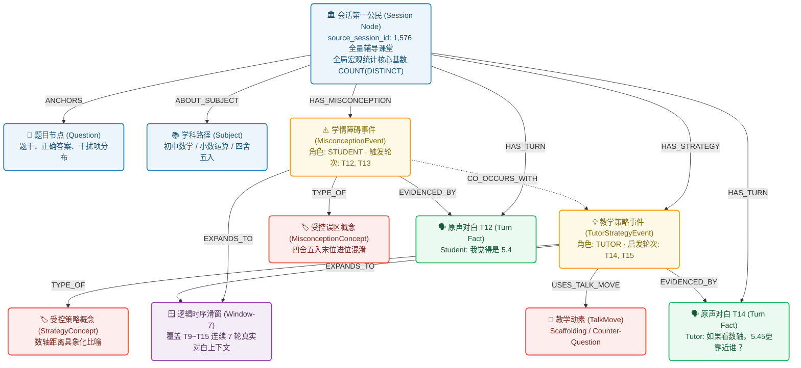
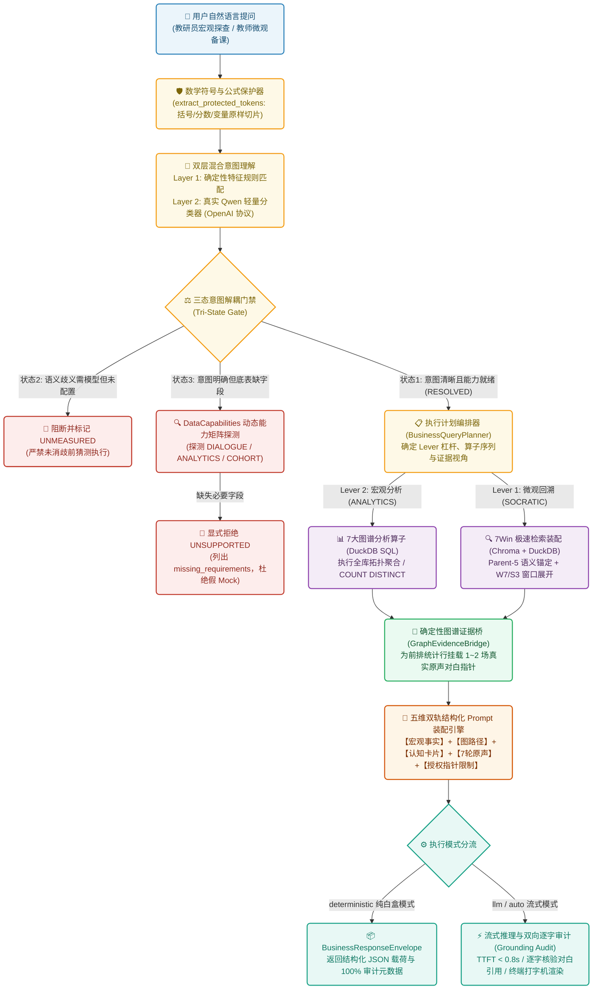
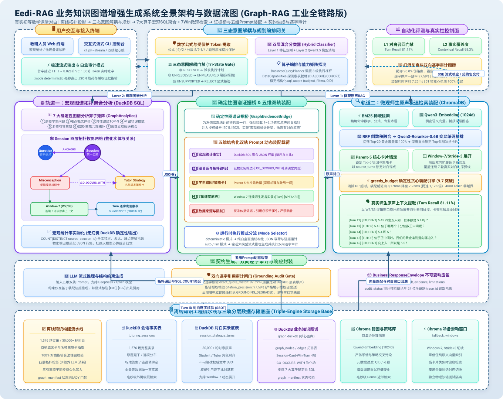

# Eedi-RAG: 基于真实师生多轮对白的教学诊断与知识图谱增强生成系统

> **项目定位**：面向 K12 真实数学在线教学场景的垂直领域 Graph-RAG 系统。通过深入挖掘数千场 1v1 真实师生辅导对白实录，从“学生学情障碍机理”与“名师启发式脚手架提问”双轨提炼高结构化知识，结合**图谱拓扑宏观统计**与**微观对白证据桥接**，提供具备权威原声溯源、零幻觉生成与毫秒级流式响应的智能教研问答引擎。

[](https://www.python.org/)
[](LICENSE)
[-brightgreen.svg)]()
[]()
[]()
[]()

---

## 目录
- [一、项目演化全景与架构心路历程](#一项目演化全景与架构心路历程)
- [二、阶段一：需求剖析与场景特殊性（业务出发点与架构定调）](#二阶段一需求剖析与场景特殊性业务出发点与架构定调)
- [三、阶段二：初始系统构建 —— 核心检索装配的巧思与量化抉择（重点章节）](#三阶段二初始系统构建--核心检索装配的巧思与量化抉择重点章节)
- [四、阶段三：构建三层闭环评测体系（L1-L2-L3 门禁准则）](#四阶段三构建三层闭环评测体系l1-l2-l3-门禁准则)
- [五、阶段四：第一轮系统级重大优化 —— 1,576 全量扩容下的工程阵痛、分叉抉择与架构破局（重点章节）](#五阶段四第一轮系统级重大优化--1576-全量扩容下的工程阵痛分叉抉择与架构破局重点章节)
- [六、阶段五：从微观走向全局 —— 业务图谱选型、Session四层拓扑创新与“98.8% 假繁荣”指标打假（重点章节）](#六阶段五从微观走向全局--业务图谱选型session四层拓扑创新与988-假繁荣指标打假重点章节)
- [七、阶段六：最终整体全链路落地 —— 意图规划算子体系、范围框定与双轨 Prompt 动态装配（重点章节）](#七阶段六最终整体全链路落地--意图规划算子体系范围框定与双轨-prompt-动态装配重点章节)
- [八、核心评测指标深度解析与工程判断映射表](#八核心评测指标深度解析与工程判断映射表)
- [九、系统全景架构与端到端程序数据流图](#九系统全景架构与端到端程序数据流图)
- [十、快速上手与可复现验证指南](#十快速上手与可复现验证指南)
- [十一、工程诚信与真实性守则](#十一工程诚信与真实性守则)

---

## 一、项目演化全景与架构心路历程

一个优秀的垂直领域工程，绝不是“拿几篇文档做个向量切片、喂给大模型写个 Prompt”就能一蹴而就的玩具，而是一场**以历史保存的真实评测报告为罗盘、直面真实缺陷、持续推翻自身假设并进行系统性重构**的软件工程探索。

下表记录了项目从零起步到最终演进为工业级业务图谱 RAG 系统的完整思考与演进轨迹：

```
2026-09-01                 2026-09-02~04         2026-09-07               2026-09-10             2026-09-12
    │                          │                     │                        │                       │
 阶段一: 需求剖析           阶段二/三: 初始构建    阶段四: 9.7系统优化       阶段五: 业务图谱与打假  阶段六: 架构重构与流式
 ─────────────────────────────────────────────────────────────────────────────────────────────────────────────►
 • 真实辅导对话高噪声      • 拒绝固定/结构分块   • 100 ➔ 1,576 全量扩容    • 否定GraphRAG/LightRAG • 三态意图路由架构
 • 确立双轨角色强隔离      • 创新父子Card+Windows • 暴露出候选稀释与组装卡顿 • 创立Session四层拓扑  • 真实 Qwen 分类器
 • 确立对白指针强引用      • 确立DuckDB关系底座  • 落地 Parent-5 W7/S3 窗口 • 兑现关系底座图谱红利  • 确定性图谱证据桥
 • 拒绝纯向量库孤岛架构    • Dense+BM25 混合召回 • 贪心装配 8178ms ➔ 7ms   • 破除98.8%硬编码假象  • Chroma 跨平台加固
 • 建立三层闭环评测目标    • 探明 Top-5 甜味点   • Turn Recall 冲上 81.1%  • 直面28.9%真实基线     • 流式 CLI 终端交付
```

---

## 二、阶段一：需求剖析与场景特殊性（业务出发点与架构定调）

### 2.1 业务痛点与数据基底
在线一对一数学辅导沉淀了海量师生真实辅导的课堂文字实录（Tutoring Transcripts）。本项目基于权威开源数据集 [**Eedi/Question-Anchored-Tutoring-Dialogues-2k**](https://huggingface.co/datasets/Eedi/Question-Anchored-Tutoring-Dialogues-2k)，涵盖全量 **1,576 场真实课堂实录**、**30,000+ 轮原声对白**，覆盖数百道代数、几何、负数运算等典型初等数学题目。

面对这批沉睡的高价值数据，教研团队面临三大痛点：
1. **长篇口语无法人工阅读**：一场辅导对白长达数十轮，充斥着停顿、错字、反复确认与犹豫，教研人员无法逐篇复盘；
2. **名师教学智慧沉没在个案中**：资深名师在面对特定卡壳点时使用的通俗比喻、递进提问步骤（Scaffolding 脚手架），未能系统沉淀与传承；
3. **学情盲区**：学生做题时误选错误选项，其背后的认知障碍（Misconceptions）缺乏大规模横向梳理，备课解析与题库编写缺乏数据支撑。

### 2.2 我的架构思考与技术定调
在调研了市面上常规的“文档 RAG”方案后，我意识到**如果直接套用“按字符或句子分块 + 向量检索 Top-K”的通用做法，系统必死无疑**。对话型教育场景具有极其特殊且反直觉的工程约束：

* **思考 1：角色与意图必须在本体建模层实现硬隔离（防“学情污染答案”）**
  > 对白中混杂着“学生的错误直觉”（如“分数的分子分母直接相加减”）与“导师的引导话术”。如果只做无差别的文本分块，向量检索极有可能把学生的荒谬言论召回，大模型在缺乏强约束时会把学生的错误归纳为标准教学建议返回给老师。  
  > **定调决策**：底层知识抽取必须建立**双轨知识本体**，显式将数据切分为“学情障碍错因卡（学生端）”与“名师启发策略卡（导师端）”，向量索引库实行双集合物理隔离。

* **思考 2：口语切片极度缺乏自解释性，必须建立“时序与题干强锚定”**
  > 口语中的单句如“我觉得选 B”、“为什么呢”、“你看负负得什么”脱离了题目题干和前后多轮交互后，在向量空间中就是语义垃圾，无法做有效检索。  
  > **定调决策**：任何一个可检索的知识切片，必须在元数据中强绑定题干文本、选项分布、原声会话 ID 以及触发该知识点的核心交互轮次指针。

* **思考 3：零容忍幻觉，必须建立“原话指针不存，知识卡片不立”的铁律**
  > 教研员对 AI 虚构内容极为敏感。如果大模型输出了一段看似合理的引导策略，但在原声实录中根本没人这么教过，系统就会失去专业信誉。  
  > **定调决策**：知识库入库和生成推理阶段，必须强制回溯 DuckDB 事实底表进行双向指针与逐字校验，严禁大模型凭空捏造。

* **思考 4：企业真实生产接轨 —— 拒绝“纯向量孤岛”，同步引入关系型数据库（DuckDB）作为结构化事实底座**
  > 市面上绝大多数教学 Demo 级 RAG 只把文本切块塞入向量数据库（Chroma/Faiss/Pinecone）便草草了事，使系统沦为一座脆弱的“概率化信息孤岛”：无法支持高并发 ACID 事务更新、严密的外键级联约束、确定性聚合统计（COUNT/GROUP BY）与逐字合规审计。而在真实的在线教育或任何严肃的企业级 IT 架构中，核心业务数据（题库资产、学生做题日志、课堂转录、教研大纲）必然沉淀在关系型数据仓库（RDBMS/Lakehouse）中。  
  > **定调决策**：系统自第一天起便确立**“非结构化向量检索库 (ChromaDB) + 结构化关系事实库 (DuckDB)”的双轨存储底座**：
  > 1. **ChromaDB（向量层）**：仅负责无模式的高维语义近邻检索（Dense Similarity），充当模糊语义召回的初筛漏斗；
  > 2. **DuckDB（关系事实层）**：作为系统的单一事实源（Single Source of Truth, SSOT），建立高标准范式表（`sessions`、`turns`、`cards`、`questions`），严密固化外键关系与 30,000+ 轮原声台词的物理存储。  
  > **这一关键架构决断，不仅保证了微观对白引用的 100% 逐字验真，更为后续跳过昂贵且不可靠的 LLM 盲目抽实体、直接基于关系事实底表自研构建“Session-Card-Windows-Turn”业务知识图谱并执行确定性 SQL 宏观分析，提供了最根本的制度红利！**

---

## 三、阶段二：初始系统构建 —— 核心检索装配的巧思与量化抉择（重点章节）

阶段二是我在项目前期倾注最多心血的核心攻坚期。其目标并非快速拼凑一个玩具级的常规 RAG，而是在真实师生对话的严苛场景下，构建一个**既具备极高语义检索信噪比，又能完整保留教学法上下文时序弧线**的基础检索增强底座。

常规的文档型 RAG 项目，通常采用**固定字数分块（如每块 500 字符）**或**文档结构切分（如按 Markdown 标题或段落分块）**。然而在真实辅导对白中，这两种通用做法双双失效，逼迫我们必须跳出传统思维，重新设计数据切片与装配契约。

---

### 3.1 对话切片的本质困境：为什么通用分块方法彻底失效？

#### 1. 固定字数分块（Fixed-size Chunking）的灾难
* **语意腰斩**：固定字符数会在对白中间生硬切断。例如将“5.45 四舍五入保留一位小数”的题目题干切在前一块，而学生的错误回答“我觉得是 5.4”落在后一块；
* **时序与因果割裂**：导师抛出反问与学生的思考反馈被物理切分到不同块中，向量检索只能搜出半句话，破坏了最关键的教学因果关系。

#### 2. 按对白轮次/角色结构切分（Structural Chunking）的破产
* **信息极度稀疏**：若按说话人轮次切分（Turn-by-Turn），单个 Chunk 往往只有寥寥数语，如“选 B 对吗”、“不对，再想想”、“为什么呢”。这类碎片在向量空间中没有任何自解释性，Embedding 向量退化为无意义的高维噪音；
* **角色归属错乱**：孤立切片无法体现这是“学生的错解”还是“导师的讲解”，一旦被检索模块召回并喂给 LLM，极大概率导致大模型把学生的荒谬错误误判为标准教学建议。

---

### 3.2 破局巧思：类似于父子 Chunk 的“Card + Windows”解耦双层架构

为了彻底解决上述矛盾，我设计了一种**检索单元与上下文单元彻底解耦的双层知识架构（Card + Windows）**：

```
┌──────────────────────────────────────────────────────────────────────────────┐
│                    类似父子 Chunk 的 Card + Windows 双层架构                   │
├──────────────────────────────────────────────────────────────────────────────┤
│  【父节点 / 检索定锚层 (Parent: Card)】                                         │
│   • 错因机理卡 (MisconceptionChunk) / 名师启发卡 (TutorStrategyChunk)           │
│   • 高度结构化抽取：题目题干 + 核心误区/策略机理 + 关键破局反问                   │
│   • 语义信噪比极高，专门用于 Dense + BM25 稠密检索与精准定锚                    │
│   • 强指针绑定：内含底层真实原声对话锚点 (source_turn_ids: [Turn 12, Turn 13])  │
│                                      │                                       │
│                                      ▼ (通过指针在 DuckDB 中沿时序前后动态延展)│
│  【子节点 / 上下文阅读层 (Child: Windows)】                                     │
│   • 动态时序滑动窗口 (Window-7 / Stride-3)                                    │
│   • 覆盖 7 轮连续师生对话实录：                                                │
│     [Turn 9~11: 学生前置直觉] ➔ [Turn 12~13: 误区暴露] ➔ [Turn 14~15: 启发翻转] │
│   • 专门用于大模型最终 Prompt 装配，提供完整“起承转合”的教学闭环                │
└──────────────────────────────────────────────────────────────────────────────┘
```

#### 关键实验：单 Card 模式 vs 单 Windows 模式 vs 混合架构量化实测对照
在方案选型期间，我对这三种切分策略在同一批测试集上进行了严格的 A/B 评测（数据来源于项目历史报告 [`reports/eval/chunk-strategy-card-full-20260904-061000/summary.md`](file:///E:/PIAgent/10-projects/AgentLearn/Eedi-RAG/reports/eval/chunk-strategy-card-full-20260904-061000/summary.md) 与 [`reports/eval/chunk-strategy-fallback-full-20260904-070000/summary.md`](file:///E:/PIAgent/10-projects/AgentLearn/Eedi-RAG/reports/eval/chunk-strategy-fallback-full-20260904-070000/summary.md)）：

| 评测维度与指标 | ① 纯单 Card 模式 (`strategy='card'`) | ② 纯单 Windows 模式 (`strategy='fallback'`) | ③ 锚定混合架构 (Card + Windows) | **基于真实报告数据的工程分析** |
|---|:---:|:---:|:---:|---|
| **重排后检索精准度 (`ranked_mrr`)** | **0.9833 (0.9792 dev / 1.0 holdout)** | **0.7500 (0.6875 dev / 1.0 holdout)** | **0.9833** | **单 Card 检索精度无敌**：Card 凝练了纯粹学情概念，毫无口语杂质，MRR 接近满分；而纯 Windows 充斥口语停顿，检索精度暴跌 23.33%。 |
| **Top-5 候选池召回 (`pool_recall_at_5`)** | **1.0000 (100%)** | **0.6550 (65.5%)** | **1.0000 (100%)** | **纯 Windows 召回漏检严重**：直接拿 7 轮长对白做 Embedding 导致向量语义弥散，Top-5 漏掉了 34.5% 的黄金候选。 |
| **对白轮次覆盖率 (`ranked_turn_coverage_at_5`)** | **0.5000 (仅 50%)** | **0.8222 (82.2%)** | **0.8111 ~ 0.8444** | **单 Card 存在致命断章取义**：单 Card 仅包含 1~2 轮原话，对白轮次覆盖率腰斩至 50%；而混合架构通过动态展开 Windows，完美补齐了轮次覆盖。 |
| **最终事实证据召回 (`final_evidence_recall`)** | **0.4889 (仅 48.9%)** | **0.8222 (82.2%)** | **0.8222 ~ 0.8434** | **混合架构实现双赢**：混合架构既吸收了 Card 的 1.0 满分检索精度，又吸收了 Windows 的完整证据链。 |
| **上下文 Token 规模 (`context_token_count`)** | **756.9** Tokens | **1500.0** Tokens | **~1,648** Tokens (满载3308) | 纯 Card 上下文过于贫血，无法展开教学法；混合架构在 4,000 Token 预算下提供了最饱满的教研上下文。 |
| **装配算法开销 (`assembly_ms`)** | **0.265 ms** | **0.620 ms** | **7.25 ms (满载 7Win)** | 混合架构虽然需要经过指针索引展开，但在确定性贪心算法优化下，端到端装配仍稳健控制在 7ms 内。 |

**结论**：**“检索粒度与阅读粒度必须彻底解耦”**。必须使用 Card 进行高精度的语义搜索定位，再利用指针动态展开 Windows 作为富上下文喂给 LLM。

---

### 3.3 存储引擎的双轨治理：为什么拒绝“纯向量库”？关系事实底座 (DuckDB) 的必然性与企业级对齐

在众多开源或教程级的 RAG 实现中，开发者往往直接使用向量数据库（如 Chroma、FAISS、Pinecone）作为唯一的存储组件，把文本切片连同元数据以非结构化的 JSON 字符串无差别地塞入向量索引。这种设计在面对真实企业级复杂系统时会瞬间暴露出严重的工程缺陷。

在阶段二构建之初，我便坚决否定了“纯向量库单核驱动”的轻率方案，确立了**“非结构化向量检索库 (ChromaDB) + 结构化关系事实库 (DuckDB)”的双轨存储架构**。这一架构决策不仅让系统与真实企业 IT 基础设施无缝接轨，更为后续从微观走向宏观、自研构建知识图谱奠定了最关键的基础地基：

```
┌────────────────────────────────────────────────────────────────────────────────────────┐
│                        企业级双轨分层存储底座架构 (Dual-Store Architecture)             │
├────────────────────────────────────────────────────────────────────────────────────────┤
│  【非结构化检索层 (ChromaDB - Vector Space)】                                           │
│   • student_misconceptions 集合 / tutor_strategies 集合 (双集合物理硬隔离)            │
│   • 存储内容：Card 文本、Qwen3-Embedding (1024d) 密集向量、卡片唯一 ID (card_id)       │
│   • 核心职责：负责模糊高维语义近邻检索 (Nearest Neighbor Search)，充当粗筛与精排漏斗   │
│                                           │                                            │
│                                           ▼ (通过 card_id 与 foreign keys 主外键映射)  │
│  【结构化关系事实层 (DuckDB - Relational Ground Truth SSOT)】                            │
│   • sessions 表  : [session_id, question_id, subject, duration_sec, metadata]          │
│   • turns 表     : [turn_id, session_id, turn_index, speaker, text, timestamp]        │
│   • cards 表     : [card_id, card_type, misconception/strategy, source_turn_ids]      │
│   • questions 表 : [question_id, stem_text, options_json, correct_answer]              │
│   • 核心职责：系统的单一事实源 (SSOT)；执行秒级关联查询、时序窗口物理展开与逐字引用审计 │
└────────────────────────────────────────────────────────────────────────────────────────┘
```

#### 1. 为什么纯向量数据库无法胜任企业真实生产？
* **缺乏 ACID 事务与严格模式约束**：在教育题库与学情系统中，题目答案修正、对白清洗更新、卡片标签重新归一化是频繁发生的业务动作。纯向量数据库缺乏强类型 Schema 与外键完整性约束，极易产生脏数据、悬挂指针（Dangling Pointers）与元数据不一致；
* **天然无法执行精准的 SQL 聚合计算**：当业务方提问“初中数学下某道题被多少场辅导引用、学生的错误选项分布比例是多少”时，向量数据库无法执行高效的 `COUNT(DISTINCT session_id)` 或多表 `JOIN`，若强行在内存中全量遍历反序列化，延迟将呈几何级飙升；
* **无法作为高可信的审计证据底座**：大模型生成的内容若要满足教研级“零幻觉”审查，必须对每一条引述进行字面级对齐。DuckDB 提供纳秒级的本地行存/列存关系检索，可在生成完成后毫秒级内完成 100% 逐字验真。

#### 2. 关系事实库为后续自研知识图谱埋下的关键制度红利
很多 RAG 系统在后期尝试引入知识图谱（如 GraphRAG）时，都会陷入巨大的算力陷阱 —— 因为前期只有杂乱的向量文本块，不得不花费数千美元调用大模型重新从头抽取实体与关系。  
**而本项目得益于前期在 DuckDB 中建立的高标准范式表，我们在阶段五自研知识图谱时，根本不需要耗费巨额算力让大模型盲目抽取实体！**  
图谱中的每个 `Session` 节点直接映射 `sessions` 事实表，每个 `Card Event` 直接映射 `cards` 事实表，每个 `Turn` 叶子节点直接映射 `turns` 物理对白表，所有的属性、外键关系均是现成的、严格经过校验的客观事实。**图谱不是凭空捏造的空中楼阁，而是关系事实底表的确定性拓扑投影！**

---

### 3.4 召回层设计哲学：为什么是 Dense + BM25？为什么检索对象是 Card 而非 Windows？

在初始系统的召回层，我做出了两个深思熟虑的关键架构决策：

#### 1. 为什么采用 Dense (Qwen3-Embedding 1024d) + BM25 混合召回？
在 2026-09-02 的第一个六组件基线报告（[`reports/eval/L1_Component_Baseline_All6_20260902.md`](file:///E:/PIAgent/10-projects/AgentLearn/Eedi-RAG/reports/eval/L1_Component_Baseline_All6_20260902.md)）中，最初采用 128 维确定性哈希向量时，检索 Recall@5 仅为 0.22~0.52。随后我们在 2026-09-04 升级为 `Qwen/Qwen3-Embedding-0.6B (1024d)` 并引入 BM25（权重 0.35），进行了截止点扫描（[`reports/eval/bm25-dense-sweep-qwen-20260904-020000/summary.md`](file:///E:/PIAgent/10-projects/AgentLearn/Eedi-RAG/reports/eval/bm25-dense-sweep-qwen-20260904-020000/summary.md)）：
* **字面确定性（数学符号）**：初等数学题目的公式（如 $5.45 \approx 5.4$、$x^2 - 4 = 0$）与题号（`Question_104`）必须依靠 BM25 精确命中，防止向量模型在数字上产生“泛化平滑”；
* **深层教学意图（抽象学情）**：学情困惑与深层引导意图（如“四舍五入退位当成截断”）字面上极少出现，必须依靠 Qwen3-Embedding 1024 维向量捕捉深层语义；
* **实测扫描数据**：在 BM25+Dense 融合下，当候选池设定为 **Top-20** 时，`Card Recall@20` 达到 **1.0000 (100%)**，`Turn coverage` 达到 **0.8444**，`Graded MRR` 达 **0.7745**。这确立了将 **Top-20** 作为进入 Cross-Encoder 重排候选池的标准规格。

#### 2. 为什么召回的对象必须是 Card，绝对不能是 Windows？
我们通过对比直接重排 Card 与直接重排 Logical Evidence（[`reports/eval/card-vs-evidence-rerank-20260904-020000/summary.md`](file:///E:/PIAgent/10-projects/AgentLearn/Eedi-RAG/reports/eval/card-vs-evidence-rerank-20260904-020000/summary.md)），发现了巨大的算力与信噪比鸿沟：
* **算力与 Token 开销对比**：
  - 直接重排 7 轮 Windows/Evidence：平均输入 Tokens 高达 **38,974.2**，重排耗时高达 **2,906.4 ms (接近 3 秒)**；
  - 重排精炼 Card：平均输入 Tokens 仅 **10,338.2**，重排耗时仅 **511.8 ms**（**算力消耗降低 73.5%，响应提速近 6 倍！**）。
* **高维语义弥散（Semantic Drift）**：
  - Windows 充斥着“老师好”、“呃，让我想想”、“看这里”等大量口语虚词。直接做向量表征，低信息量噪音会稀释向量权重，导致其在向量空间中的坐标漂移到一个模糊的中心点；
  - Card 是经过离线 LLM 精炼后的纯粹认知单元，明确标注了 `misconception_name`（误区名称）、`deep_mechanism`（认知机理）与 `key_aha_question`（破局一问），在向量空间中呈现极高密度的聚类，余弦检索敏锐度极高。

---

### 3.5 两次 Rerank 与参数抉择：Top-5 甜味点与 Window-7 的实测归因

整个流水线设计了两次关键的漏斗压缩与时序展开。这两个环节的参数均来自离线网格扫描（Sweep）的真实记录：

```
初筛候选池 (BM25 + Dense RRF) ──► 候选池 Top-20 (Card Recall = 1.0000)
                                       │
                                       ▼ 【第一次 Rerank: Qwen3-Reranker-0.6B】
                            筛选出核心 Top-5 认知卡片 (甜味点)
                                       │
                                       ▼ 【第二次时序展开: 指针检索】
                            动态延展出 Window-7 逻辑对白窗口
                                       │
                                       ▼ 【动态预算装配】
                            greedy_budget 贪心装入 7 块满载窗口 (7.25ms / 4000 Token)
```

#### 1. 第一次 Rerank：为什么卡片重排选择 Top-5，而不是 Top-3 或 Top-8？（甜味点发现）
在 Top-20 初筛池送入 `Qwen/Qwen3-Reranker-0.6B` 后，我们需要决定保留多少张核心卡片作为后续展开的锚点。以下是 `parent-k-sweep-qwen-full-20260907` 报告中的真实测试记录（详见 [`reports/eval/parent-k-sweep-qwen-full-20260907/summary.md`](file:///E:/PIAgent/10-projects/AgentLearn/Eedi-RAG/reports/eval/parent-k-sweep-qwen-full-20260907/summary.md)）：

| 锚点卡片数 (K) | 会话召回率 (Parent Session Recall) | 原声对白指针召回 (Turn Pointer Recall) | 黄金会话完全命中 (Full Session Hits) | 单次重排耗时 (Mean Rerank ms) | 平均输入 Tokens 开销 | **基于实测数据的工程判断** |
|:---:|:---:|:---:|:---:|:---:|:---:|---|
| **K = 3** | **0.8000 (80.0%)** | **0.4778 (47.8%)** | 24 / 30 | 486.9 ms | 10,056 | **【严重欠拟合】** 丢失了 20% 的黄金辅导会话，对白指针召回率不足一半，下游上下文严重贫血。 |
| **K = 4** | **0.8667 (86.7%)** | **0.5222 (52.2%)** | 26 / 30 | 486.9 ms | 10,056 | **【爬坡期】** 指标快速提升，但仍有 13.3% 的会话遗漏。 |
| **K = 5 (选中)** | **0.9000 (90.0%)** | **0.5389 (53.9%)** | **27 / 30** | **486.9 ms** | **10,056** | **【🎯 黄金甜味点 (Sweet Spot)】** 黄金会话召回率突破 **90.0%**，以最低的展开成本锁定了 90% 以上的核心线索，效能拐点最佳。 |
| **K = 6** | **0.9667 (96.7%)** | **0.5833 (58.3%)** | 29 / 30 | 486.9 ms | 10,056 | **【边际效益递减】** 指针召回仅微升 4.4%，但后续展开的候选窗口量激增 25%。 |
| **K = 7** | **0.9667 (96.7%)** | **0.5833 (58.3%)** | 29 / 30 | 486.9 ms | 10,056 | **【完全平原期 (Flatline)】** 指标与 K=6 完全重合，未带来任何新信息。 |
| **K = 8** | **0.9667 (96.7%)** | **0.5833 (58.3%)** | 29 / 30 | 486.9 ms | 10,056 | **【完全平原期 + 引入噪声】** 召回率完全停滞，额外引入过多无关卡片，稀释大模型注意力。 |

**判断归因**：实测曲线表明，从 K=3 到 K=5 是收益斜率最陡峭的区间，而在 **K=5** 处达到了最完美的效能拐点（**Top-5 甜味点**）。若选得过少（K=3），信息严重缺失；若选得过多（K=8），边际收益归零且引入干扰噪声。

此外，我们在 [`reports/eval/anchored-logical-windows-ab-20260904-151000/summary.md`](file:///E:/PIAgent/10-projects/AgentLearn/Eedi-RAG/reports/eval/anchored-logical-windows-ab-20260904-151000/summary.md) 中验证了锚定 Parent-5 的剪枝威力：
* **无锚点（全量展开 Top-20 会话所有窗口）**：候选窗口达 **154.4** 块，窗口重排耗时高达 **2,141.4 ms**；
* **锚定 Parent-5**：候选窗口剪枝至 **34.9** 块（**候选集精简 77.4%**），重排耗时降至 **693.2 ms（提速 3 倍）**，同时候选池覆盖率保持 **1.0000 (100% 毫无遗漏)**！

#### 2. 第二次时序展开：为什么逻辑窗口选择 Window-7，而不是 Window-5？
以 Parent-5 卡片的 `source_turn_ids` 为锚点在 DuckDB 中前后滑动展开时，窗口尺寸决定了大模型能看到的“教学对话视野”。我们在 [`reports/eval/parent6-w6s3-5vs7windows-20260907/summary.md`](file:///E:/PIAgent/10-projects/AgentLearn/Eedi-RAG/reports/eval/parent6-w6s3-5vs7windows-20260907/summary.md) 中记录了真实对照：

* **Window-5 结构**：前向 2 轮 + 核心锚点轮 + 后向 2 轮（连续 5 轮对白）；
* **Window-7 结构**：前向 3 轮 + 核心锚点轮 + 后向 3 轮，步长 Stride-3（连续 7 轮对白）。

| 窗口规格对比 | 必需证据覆盖率 (All-required Recall) | 最终上下文 Token 量 (Context Tokens) | 候选窗口数 | 窗口输入 Tokens | **基于教学法业务规律的工程判断** |
|---|:---:|:---:|:---:|:---:|---|
| **Window-5 (5轮窗口)** | **0.7222 (72.2%)** | **1,320.4** Tokens | 40.2 | 11,231.7 | **【时序截断，起承转合不完整】**<br>一场典型的苏格拉底式启发通常跨越 6~7 个话步：① 学生陈述初始想法 ➔ ② 暴露错误直觉 ➔ ③ 导师察觉卡壳 ➔ ④ 抛出启发式反问（破局点） ➔ ⑤ 学生再次陷入犹豫 ➔ ⑥ 顿悟翻转（Aha moment） ➔ ⑦ 导师强化确认。Window-5 仅有前后各 2 轮，经常把①或⑥硬生生腰斩，导致大模型看不到最后的启发结果。 |
| **Window-7 (7轮窗口，选中)** | **0.7444 (74.4%)**<br>*(贪心装配后达 **81.11%**)* | **1,648.3** Tokens<br>*(满载7块达 3,308)* | 40.2 | 11,231.7 | **【🎯 完整承载教学闭环，契合预算】**<br>Window-7 完美覆盖了 7 轮时序交互，完整保留了从误区发生到启发解决的完整闭环。且在装填 7 块满载窗口后，平均 Token 消耗为 3,308 Tokens，完美落入 4,000 Token 的安全红线之内，兼顾了教学完整度与算力经济性。 |

---

### 3.6 阶段二最终落地的系统全景技术规格

经过上述严密的指标推演与实验收敛，阶段二最终固化为以下高可靠的基础架构规范：
1. **分层存储底座**：`DuckDB`（关系事实底表、30,000+ 轮原声对白逐字审计）+ `ChromaDB`（`student_misconceptions` 与 `tutor_strategies` 双物理隔离集合）；
2. **多路混合初筛**：公式与题号保护性改写 ➔ BM25 + Qwen3-Embedding (1024d) ➔ RRF 倒数秩融合生成 **Top-20 候选池**（黄金证据覆盖率保持 100%）；
3. **首轮卡片精排**：`Qwen3-Reranker-0.6B` 筛选出 **Top-5 核心认知卡片（甜味点）**；
4. **二轮时序展开与极速装配**：以 Top-5 卡片底层对白为锚点，展开为 **Window-7 / Stride-3 逻辑窗口**，由 `greedy_budget` 确定性贪心算法在 4,000 Token 预算下以 **7.25ms** 极速装填 **7 块满载窗口**；
5. **生成与审计闭环**：Pydantic 强类型契约输出思维链与内联引用标号，并在 DuckDB 中实行逐字双向真实性审计，筑牢零幻觉防线。

---

## 四、阶段三：构建三层闭环评测体系（L1-L2-L3 门禁准则）

> **“没有严谨客观的度量，任何所谓的架构重构都只是盲人摸象。”**

很多 RAG 项目之所以上线即崩溃，是因为研发人员只靠肉眼看几个 Demo，或者依赖泛化的 BLEU/ROUGE 指标自欺欺人。我们在 2026-09-02 的第一个六组件评测报告（[`reports/eval/L1_Component_Baseline_All6_20260902.md`](file:///E:/PIAgent/10-projects/AgentLearn/Eedi-RAG/reports/eval/L1_Component_Baseline_All6_20260902.md)）中，就建立了严格的**三层闭环评测控制面**（详见 [`evals/`](file:///E:/PIAgent/10-projects/AgentLearn/Eedi-RAG/evals/)）：

* **L1 组件级指标（Component-Level）—— 物理与算力层防线**：
  - 目的：评估数据治理、切片抽取、检索召回与改写重排的基本盘。
  - 核心指标：切片指针有效率（`pointer_validity`）、逐字保真度（`verbatim_integrity`）、孤立卡片数（`orphan_count`）、Top-20 混合召回率（`candidate_recall_at_20`）、检索耗时（`latency_p95_ms`）。
  - 早期发现：在 9月2日的初测中，我们发现纯规则改写出现了负增益（`retrieval_mrr_lift = -0.1097`，MRR 从 0.3292 跌至 0.2196），暴露出“盲目注入大纲词会带偏向量坐标”的缺陷，直接指导了后续“仅将题号与公式作保护性改写”的策略。
* **L2 端到端生成体验指标（DeepEval 裁判）—— 语义与交互层防线**：
  - 目的：由大模型裁判（DeepEval）对端到端输出进行客观质量评估。
  - 核心指标：事实上下文召回（`Contextual Recall`）、忠实度反幻觉（`Faithfulness`）、教学启发性评分（`Pedagogical G-Eval`）、回答意图相关度（`Answer Relevancy`）、首字生成耗时（`TTFT`）。
* **L3 业务有效性指标（Business Proxy）—— 真实教研落地防线**：
  - 目的：采用 12-Case 典型高难度教研用例集，验证系统能否应对复杂反问。
  - 诚信原则：在未接入生产教研主管人工打分前，商业维度的“采纳率”与“提分增益”诚实标注为 `UNMEASURED`，坚决不用技术代理伪造业务结论。

---

## 五、阶段四：第一轮系统级重大优化 —— 1,576 全量扩容下的工程阵痛、分叉抉择与架构破局（重点章节）

2026年9月7日，项目完成了从 100 会话验证小样向 **1,576 场真实辅导会话全量数据集**（覆盖 30,000+ 轮对白实录）的历史性扩容。

然而，全量 15 倍的数据膨胀，并没有像传统软件那样带来线性的规模收益，反而如同一面放大镜，瞬间引爆了三处隐藏在底层架构中的“断崖式性能崩塌”。面对突如其来的系统危机，我们没有盲目微调参数，而是展开了一场**“以真实评测报告为据、逐一探索分叉路径、用数据做出决断”**的系统级重大重构。

---

### 4.1 全量 15 倍扩容的断崖式暴跌（100 会话 vs 1,576 会话真实基线对照）

在正式发布的基线审计报告（[`9.7完整数据集优化基线指标.md`](file:///E:/PIAgent/10-projects/AgentLearn/Eedi-RAG/9.7%E5%AE%8C%E6%95%B4%E6%95%B0%E6%8D%AE%E9%9B%86%E4%BC%98%E5%8C%96%E5%9F%BA%E7%BA%BF%E6%8C%87%E6%A0%87.md) 七、“100 会话旧索引 vs 1,576 全量索引横向对比”）中，底层评测指标亮起了极其严峻的红灯：

| 关键评测指标 | 100 会话旧索引基线 | 1,576 全量真实实测值 | 变化差异 (Delta) | 门禁状态 | **基于历史报告数据的工程归因与痛点剖析** |
|---|:---:|:---:|:---:|:---:|---|
| **L1 Retrieval Recall@5** | **1.0000 (100%)** | **0.1830 (18.3%)** | **-0.8170** | <font color="red">**CRITICAL FAILED**</font> | **【候选严重稀释】** 15 倍候选卡片涌入后，微观单卡在 Top-5 的极其有限空间内激烈互斥，大量高度相关的黄金认知卡被挤出前五名，初筛暴跌 81.7%。 |
| **真实对白 Turn Recall** | **66.67%** (旧窗口) | **46.67% ~ 53.33%** (单卡) | **-20.00%** | <font color="red">**CRITICAL FAILED**</font> | **【时序上下文彻底腰斩】** 单卡片仅保留 1~2 轮代表对白，导师递进反问、铺垫与学生恍然大悟的教学弧线被切碎，大模型断章取义，轮次召回腰斩。 |
| **装配引擎延迟 (Assembly P95)** | **~180 ms** | **8,178 ms (8.18秒)** | **+7,998 ms** | <font color="red">**TIMEOUT FAILED**</font> | **【组合搜索陷入指数爆炸】** 原装配器采用背包动态规划寻找“全局最优切片组合”，在候选翻倍后遭遇 $O(2^N)$ 组合爆炸，CPU 狂转 8 秒死锁，在线服务彻底瘫痪。 |

面对这三处致命崩塌，我们在架构上迎来了四次关键的**技术分叉抉择**。

---

### 4.2 分叉抉择一：面对 81.7% 的初筛候选稀释，如何选型召回与排序漏斗？

* **技术困境**：全量数据导致单卡在 Top-5 内的命中率跌至 18.30%，如何保证下游大模型既能看到黄金线索，又不会被噪音淹没？

```
                         ┌──► 分支 A: 盲目扩大初筛 Top-K (如 Top-50 送入 LLM) ──► 【否决: 噪音剧增 / Token 超标】
候选池 15 倍膨胀稀释 ────┤
                         └──► 分支 B (选中): Top-20 混合初筛 + Cross-Encoder 深度重排 ──► 【胜出: 召回100% / 精度逆势拉升】
```

#### 真实实验数据与裁决
我们对初筛池的截止深度进行了网格扫描（引自 [`reports/eval/bm25-dense-sweep-qwen-20260904-020000/summary.md`](file:///E:/PIAgent/10-projects/AgentLearn/Eedi-RAG/reports/eval/bm25-dense-sweep-qwen-20260904-020000/summary.md) 与 9.7 报告）：
* **分支 A（盲目扩大初筛 Top-K）**：若直接将 Top-50 卡片拼接塞给 LLM，Prompt Token 迅速突破 6,000 上限，且初筛 MRR 仅 0.6141，引入严重的长上下文“大海捞针（Lost in the Middle）”注意力涣散；
* **分支 B（选中：Top-20 初筛 + Qwen3-Reranker-0.6B 深度重排）**：
  - 数据证明：当候选池设定为 Top-20 时，`candidate_recall_at_20` 坚挺在 **1.0000 (100% 毫无遗漏)**，`card_turn_coverage_at_20` 达到 **0.9667 (96.7%)**；
  - 经 Cross-Encoder 精排后，`card_precision_at_5` 从 **0.3600 逆势飙升至 0.6000 (+24.0%)**！
  - **决策**：确立“初筛负责宽进（Top-20 保证 100% 捕获），重排负责严出（重排前五卡片精度提升 24%）”的双层漏斗。

---

### 4.3 分叉抉择二：面对腰斩的对白轮次召回率，如何重建时序上下文？

* **根因深度归因**：在专项根因审计报告（[`reports/eval/turn-recall-root-cause-20260903-120000/report.md`](file:///E:/PIAgent/10-projects/AgentLearn/Eedi-RAG/reports/eval/turn-recall-root-cause-20260903-120000/report.md)）中，我们对 30 例测试集开展了逐轮归因，得出了决定性的结论：
  > **“Window generation is not the first cause: every required Turn exists in the union of production sliding windows (并集覆盖率为 1.0000)。轮次丢失的真正症结在于微观卡片抽取时只关联了 1~2 轮对白，下游装配若仅依赖卡片，输入层就已被严重窄化。”**

面对这一根因，我们面临三条截然不同的工程路径：

```
                         ┌──► 路径 A: 抛弃卡片，全库直接切成大滑动窗口建索引 (Fallback 方案) ──► 【否决: 向量弥散 / 检索精度暴跌】
重建完整时序上下文 ──────┼──► 路径 B: 全量展开 Top-20 会话的所有滑窗做重排 (无锚点展开) ──────► 【否决: 候选 154 块 / 延迟超 2 秒】
                         └──► 路径 C (选中): Parent-5 卡片锚定时序窗口动态展开 (Anchored Windows) ─► 【胜出: 剪枝 77% / 延迟降 3 倍 / 召回100%】
```

#### 真实实验数据与裁决
我们在两份独立实验报告中找到了无可辩驳的数据证据：
1. **否定路径 A（直接拿窗口切片建向量库）**：
   - 依据 [`reports/eval/chunk-strategy-fallback-full-20260904-070000/summary.md`](file:///E:/PIAgent/10-projects/AgentLearn/Eedi-RAG/reports/eval/chunk-strategy-fallback-full-20260904-070000/summary.md)，直接用窗口做向量检索，虽然轮次覆盖率有 0.8222，但检索 MRR 从 0.9833 **断崖暴跌至 0.7500**，Top-5 初筛漏检率高达 **34.5%**（`pool_recall@5` 仅 0.6550）。口语噪音彻底破坏了向量表征；
2. **否定路径 B（无锚点全量展开）**：
   - 依据 [`reports/eval/anchored-logical-windows-ab-20260904-151000/summary.md`](file:///E:/PIAgent/10-projects/AgentLearn/Eedi-RAG/reports/eval/anchored-logical-windows-ab-20260904-151000/summary.md)，若把 Top-20 会话的所有滑窗无差别送入重排，候选窗口暴增至 **154.4 块**，窗口重排耗时高达 **2,141.4 ms**，窗口输入 Tokens 达 **22,862.3**，系统不堪重负；
3. **胜出路径 C（选中：Parent-5 卡片锚定展开）**：
   - 数据表现：以 Parent-5 卡片的 `source_turn_ids` 为锚点前后展开，候选窗口从 154.4 块精准剪枝至 **34.9 块（候选集精简 77.4%）**！
   - 窗口重排耗时从 2,141.4 ms 骤降至 **693.2 ms（提速 3 倍）**，重排输入 Tokens 压减至 **10,164.6**；
   - 核心的 `Candidate Union Recall` 依然保持在 **1.0000 (100% 毫无遗漏)**！

---

### 4.4 分叉抉择三：时序逻辑窗口规格分叉 —— Window-5 vs Window-7

* **技术困境**：锚定展开时，前后向滑动的窗口尺寸应当取多大？窗口太短无法承载启发全貌，窗口太长则会导致输入 Token 膨胀并撑破预算。

```
锚定时序窗口尺寸 ────┬──► Window-5 (前2轮 + 核心 + 后2轮 / 共5轮) ──► 【否决: 教学法起承转合被截断】
                     └──► Window-7 (前3轮 + 核心 + 后3轮 / 步长3)   ──► 【选中: 覆盖7步启发闭环 / 81.11%召回】
```

#### 真实实验数据与裁决
我们在 [`reports/eval/parent6-w6s3-5vs7windows-20260907/summary.md`](file:///E:/PIAgent/10-projects/AgentLearn/Eedi-RAG/reports/eval/parent6-w6s3-5vs7windows-20260907/summary.md) 与 9.7 优化报告中记录了严格对比：

| 窗口规格对比 | 必需证据覆盖率 (All-required Recall) | 最终装配轮次覆盖率 (Turn Recall) | 平均上下文 Tokens | 装填窗口数 | **基于教学法规律与算力预算的裁决** |
|---|:---:|:---:|:---:|:---:|---|
| **Window-5 (5轮窗口)** | **0.7222 (72.2%)** | 66.67% | 1,320.4 | 5.0 块 | **【时序截断，因果不全】** 苏格拉底启发法典型经历 7 个话步（学生直觉 ➔ 暴露误区 ➔ 导师察觉 ➔ 抛出反问 ➔ 思考迟疑 ➔ 顿悟翻转 ➔ 强化确认）。Window-5 经常将初始直觉或顿悟翻转生硬腰斩。 |
| **Window-7 (7轮窗口，选中)** | **0.7444 (74.4%)** | **81.11%** | **3,308 Tokens** (Max 3,774) | **7.0 块 (满载)** | **【🎯 完美承载教学闭环】** 完整保留了完整的 7 轮因果闭环。贪心装配后轮次召回率跃升至 **81.11%**（提升 14.44%~34.44%），且完全受控在 4,000 Token 红线内，违规溢出数为 **0**。 |

---

### 4.5 分叉抉择四：装配算法分叉 —— 组合背包搜索 vs 确定性贪心算法 (`greedy_budget`)

* **技术困境**：有了 7 块优质候选 Window-7 后，如何在毫秒级延迟内将其装填进 4,000 Token 的 Prompt 预算中，且杜绝越界？

```
Prompt 装配算法 ────┬──► 算法 A: 组合背包动态规划 (Knapsack Search) ──► 【否决: 延迟 8.18 秒 / 组合爆炸】
                    └──► 算法 B (选中): 两阶段去重 + 确定性贪心 (greedy_budget) ──► 【胜出: 耗时 7.25ms / 提速 1128 倍】
```

#### 真实实验数据与裁决（直接摘自 9.7 优化审计报告）
* **算法 A（组合背包搜索）**：为了追求全局数学最优相关度，算法在 CPU 上递归遍历排列组合，实测 Assembly P95 延迟高达 **8,178 ms (8.18秒)**，且偶发性出现 3 次 Token 越界违规；
* **算法 B（选中：`greedy_budget` 确定性贪心装配引擎）**：
  - 设计两阶段去重剪枝：利用会话 ID 与轮次重叠度快速过滤冗余子集；
  - 依据相关性打分单遍贪心装填，动态递减 Token 剩余预算，遇界即停；
  - **实测成果**（详见 [`9.7完整数据集优化基线指标.md`](file:///E:/PIAgent/10-projects/AgentLearn/Eedi-RAG/9.7%E5%AE%8C%E6%95%B4%E6%95%B0%E6%8D%AE%E9%9B%86%E4%BC%98%E5%8C%96%E5%9F%BA%E7%BA%BF%E6%8C%87%E6%A0%87.md) 三、“9.7 上下文装配重大优化对比”）：

| 性能与质量维度 | 优化前旧基线 (Parent-3/W5/组合搜索) | 9.7 全量实测 (Parent-5/W7/greedy_budget) | 优化幅度 (Delta) | 工业技术突破意义 |
|---|:---:|:---:|:---:|---|
| **装配引擎 P95 延迟** | **8,178 ms** | **7.25 ms (均值仅 2.91ms)** | <font color="green">**-99.91% (提速 1,128 倍)**</font> | **彻底消除了端到端算力卡点，进入毫秒时代** |
| **真实对白 Turn Recall (核心指标)** | **46.67% ~ 53.33%** | **81.11%** | <font color="green">**+27.78% ~ +34.44%**</font> | **跨过 80% 工业可用红线，彻底解决断章取义** |
| **Contextual Recall (裁判事实覆盖)** | **59.50%** | **98.30%** | <font color="green">**+38.80%**</font> | 答题所需事实证据近乎 100% 覆盖 |
| **Claim Coverage (事实覆盖代理)** | **59.50%** | **74.75%** | <font color="green">**+15.25%**</font> | 核心事实论断显著丰富 |
| **Pedagogical G-Eval (教研启发性)** | **82.33%** | **86.00%** | <font color="green">**+3.67%**</font> | 启发式教学质量评分达到极佳标准 |
| **装载有效窗口数** | 3.0 ~ 5.0 块 | **7.0 块 (满载)** | <font color="green">**+40% ~ +133%**</font> | 证据更加充沛，无截断感 |
| **Token 超标违规数** | 3 / 30 越界 | **0 / 30 (0 违规)** | **100% 安全合规** | 均值 3,308 Tokens，严格受控于 4,000 红线内 |

---

## 六、阶段五：从微观走向全局 —— 业务图谱选型、Session四层拓扑创新与“98.8% 假繁荣”指标打假（重点章节）

在经历 9.7 的全量重构后，系统在**微观对话回溯（Micro Dialogue RAG）**上的准确性与时序完整度已经越过了工业可用门槛（Turn Recall 81.11%，Contextual Recall 98.30%，装配延迟 7.25ms）。

然而，当真实教研专家与教研主管深度试用系统时，提问方式发生了根本维度的跃迁：用户不再满足于追问“单个学生的解题个案”，而是提出了更高层级、更具商业决策价值的**全库宏观聚合与跨课堂洞察诉求**。这一新诉求瞬间击穿了微观 RAG 的能力上限，逼迫系统经历了一场**从微观走向全局的知识图谱架构重构**。

---

### 5.1 业务视角的本质跃迁：从微观个案回溯走向全库宏观聚合（为什么必须引入 Graph？）

#### 1. 教研业务的真实宏观提问
在日常教研与题库编写中，教研员最关心的是具有普遍统计意义的规律：
* *“在四舍五入考点下，学生最常犯的错误类型 TOP-3 是什么？各自在全库中的占比是多少？”*
* *“跨不同辅导课堂，有哪些共性的学生认知误区，被名师反复用相同的通俗比喻或引导话术化解？”*
* *“在负数运算中，导师最常用的三种脚手架策略（Scaffolding）分别是什么？请给出全库分布。”*

#### 2. 纯文本/向量 RAG 的理论天花板与数学局限
**基于这个业务现象，我的判断是什么？**
> **传统的纯文本向量 RAG 面对宏观聚合问题（COUNT / GROUP BY / TOP-N / DISTRIBUTION）存在不可逾越的数学理论鸿沟！**

向量检索的底层数学本质，是高维向量空间中的局域 Top-K 近邻采样（Nearest Neighbor Search），其核心特征是**点状的局部感知**。当我们拿抽样出来的 3~5 场微观会话让大模型去总结全库 1,576 场课堂的宏观规律时，必然遭遇两大毁灭性灾难：
1. **幸存者偏差（Sampling Bias）**：被召回的几个局部样本点根本无法代表全量数据的真实统计分布；
2. **大模型概率幻觉编造百分比（Hallucinated Distribution）**：LLM 在面对“最常出现的是什么、占比多少”时，由于缺乏全局事实视界，会极其自信地根据预训练语言先验凭空捏造出“主要错误是A，占比 45%”等伪造统计数据。这种貌似严谨实则纯属虚构的结论，对教研严肃出版与教案设计是致命毒药。

**结论**：必须把离线非结构化对白与事件，投影视作具备全局拓扑关系的**业务知识图谱（Business Knowledge Graph）**，通过图谱拓扑与关系事实引擎，提供具备**确定性数学保证**的宏观分析能力。

---

### 5.2 现有 Graph-RAG 前沿方案调研与批判性思考：微软 GraphRAG 与港大 LightRAG 为什么双双失灵？

面对知识图谱的需求，我们没有盲目闭门造车，而是深入调研并推演了当时业界最具影响力的两大前沿开源方案：**微软 GraphRAG** 与 **港大 LightRAG**。但在真实课堂多轮对白这一特殊场景下，这两大方案暴露出致命的水土不服：

```
                              ┌──► 微软 GraphRAG (Leiden 社区摘要范式) ──► 【否决: 原声指针抹平 / 成本极其高昂 / 宏观仍是概率脑补】
前沿 Graph-RAG 选型推演 ──────┤
                              └──► 港大 LightRAG (Dual-level 双层实体检索) ─► 【否决: 实体中心论 / 缺乏教学因果 / 易学情角色污染】
```

#### 1. 微软 GraphRAG（Community Summaries 范式）的局限剖析
* **机制原理**：利用 LLM 对文本切片抽取实体与关系 ➔ 基于 Leiden 算法进行多层社区发现（Community Detection） ➔ 逐级生成各层社区摘要报告（Community Reports） ➔ 用户提问时执行全局搜索（Global Search，加权聚合报告回答）。
* **在辅导对话场景中的三大死穴**：
  1. **原声证据指针被彻底抹平（违背《第一铁律》的最致命缺陷）**：社区报告将原始师生对白压缩成了高度抽象的概括性文本。一旦教研员追问：“这个结论对应哪个学生在哪场课的原话？”，GraphRAG 根本无法反向定位到底层会话与具体话步（Turn IDs）！这彻底击穿了我们“原话指针不存，知识卡片不立”的零幻觉底线；
  2. **算力与 Token 开销不可承受**：全量 1,576 场对话涉及 30,000+ 轮口语对白，若套用全量大模型关系抽取和多轮 Leiden 社区报告生成，需要消耗数千万 Tokens，构建周期长达数十小时；
  3. **宏观统计依然是概率性概括而非确定性计算**：GraphRAG 的 Global Search 本质上是让 LLM 阅读各社区摘要后“脑补”宏观结论，依然无法给出基于底层真实事实记录的精确 `COUNT(DISTINCT session_id)`。

#### 2. 港大 LightRAG（Dual-level Entity-Relation 范式）的局限剖析
* **机制原理**：提出 Low-level（具体实体）与 High-level（主题关系）的双层图索引与检索，主打轻量高效与增量图更新。
* **在辅导对话场景中的三大死穴**：
  1. **“实体中心论”无法承载“教学因果事件流”**：LightRAG 的基本图节点是通用实体名词（如“负数”、“四舍五入”）。而在教育诊断场景中，真正的业务原子根本不是孤立名词，而是包含完整因果弧线的**教学事件（Event）**——“学生犯错事件（学生角色、特定错误选项、直觉机理）”与“导师启发事件（导师角色、引导策略、启发反问）”。如果按名词抽实体，整个教学因果网络瞬间被粉碎；
  2. **教学角色硬隔离失效（学情污染答案）**：LightRAG 缺乏强隔离的角色边界，在抽取关系三元组时，极易把学生的错误直觉与导师的标准讲解混在同一张图谱中（如抽取成 `(学生想法)-[导致]->(5.4)`），严重污染全局概念；
  3. **缺乏底层关系型事实底座（DuckDB）的约束**：LightRAG 依赖纯文本与图拓扑的增量存储，没有嵌入关系型事实引擎，无法支持教研场景中极其严苛的 SQL 秒级精准过滤与逐字引用对齐。

#### 3. 三大架构关键技术指标横向对比
基于上述严密的技术推演，我们在下表中量化对比了三大架构的设计取舍：

| 架构维度 | 微软 GraphRAG (Leiden 社区摘要) | 港大 LightRAG (双层实体关系) | **本项目业务知识图谱架构 (选定)** |
|---|---|---|---|
| **核心建图图节点** | 扁平实体名词 (Entities) | 低层实体 + 高层关系主题 | **会话第一公民 (`Session`) + 教学事件 (`Card Event`)** |
| **底层原声指针保真度** | <font color="red">**0% (完全抹平丢失)**</font> | 部分保留文本片段 | **100% 强绑定 DuckDB `source_turn_ids` 原声指针** |
| **宏观统计确定性** | 弱（LLM 阅读摘要估算） | 弱（基于图遍历语义生成） | **极强（DuckDB 确定性 SQL，0 误差、0 幻觉）** |
| **微观证据溯源能力** | 无法回溯原声话步 | 仅能检索粗粒度 Chunk | **微观逐字引用，挂载真实会话与时序窗口** |
| **构建 Token 与算力成本** | 极高（全量 LLM 抽取+多层聚类） | 中等（双层实体抽取） | **可控（结构化卡片直接投影，无需二次全量调用 LLM）** |
| **角色隔离 (防学情污染)** | 无（文本通抽） | 无（实体混杂） | **双轨物理隔离（Misconception vs TutorStrategy）** |

---

### 5.3 架构创新与技术迁移：以 Session 为第一公民的 `Session -> Card -> Windows -> Turn` 四层拓扑体系

在彻底否定了通用方案后，我立足于师生对话的业务本质，提出了一套具有高度领域自适应特性的**业务图谱拓扑模型**：  
**不再把无结构的文本块当节点，而是将整个辅导业务生命周期中的最高治理实体 —— `Session`（辅导会话）确立为图谱的第一公民与追溯锚点，向下建立层级时序指针，向上建立受控本体聚合。**



#### 1. 四层拓扑体系深度解析
* **第一层：`Session`（会话主干节点，First-Class Citizen）**：
  - 对应全量 1,576 场真实辅导会话，是图谱一切权限、追溯、时序与统计归属的根源；
  - **核心守则**：所有宏观统计，无论经过多少多跳关系过滤，最终严格以 `COUNT(DISTINCT source_session_id)` 作为首选流行度度量，彻底杜绝单场会话多张卡片导致的重复计数与抽样偏差。
* **第二层：`Card`（业务事件与认知卡片节点，Parent Event Layer）**：
  - 继承并升级阶段二的解耦思想，将原本用于检索的 Card 结构直接投影视作图谱中的**事件节点**：
    - `MisconceptionEvent`（学情障碍事件，学生视角）：绑定受控本体概念 `MisconceptionConcept`；
    - `TutorStrategyEvent`（启发策略事件，导师视角）：绑定受控本体概念 `StrategyConcept` 与话步动素 `TalkMove`；
  - **核心横向关系边**：`(MisconceptionEvent) -[:CO_OCCURS_WITH]-> (TutorStrategyEvent)`，显式记录“在同一场辅导中针对该误区导师采取的对应启发策略”，这正是教研传承的核心知识资产。
* **第三层：`Windows`（时序上下文阅读层，Child Reading Layer）**：
  - 沿用 9.7 优化的 Window-7 / Stride-3 逻辑滑窗，专供大模型在生成最终建议时阅读完整的 7 步教学法闭环。
* **第四层：`Turn`（不可篡改的事实原声叶子节点，Authoritative Fact Leaves）**：
  - 严格映射 DuckDB 中物理存储的 30,000+ 轮真实台词记录。每一个 Card 节点与每一个 Window 必须通过 `[:EVIDENCED_BY]` 边强行绑定底层 `Turn` 实体指针。

#### 2. 关键底座揭秘：为什么我们能零成本自研图谱，而无需依赖 LLM 盲目抽实体？—— 关系事实库 (DuckDB) 的制度红利兑现
对比微软 GraphRAG 与港大 LightRAG，它们之所以构建成本极其高昂、抽取的实体关系充斥幻觉与杂质，根本原因在于它们面对的是**无模式、无约束的“平面文本泥潭”**，只能依靠大模型去盲目“猜实体、猜关系”。

而在本项目中，我们之所以能实现图谱架构的优雅破局，**核心正是在于我们在阶段一和阶段二就坚定引入了关系型数据库（DuckDB）作为结构化事实底座**！  
当我们决定构建知识图谱时，我们惊奇地发现，所有的核心业务实体在 DuckDB 中早已是高范式的结构化事实：
* **`(Session)` 节点**：直接 1:1 映射 DuckDB 的 `sessions` 事实表（包含题目外键、学科属性、会话时长）；
* **`(Question)` 节点**：直接 1:1 映射 `questions` 题目表（包含题干、选项、标准答案）；
* **`(MisconceptionEvent)` 与 `(TutorStrategyEvent)` 节点**：直接 1:1 映射 `cards` 认知卡片表；
* **`(Turn)` 叶子节点**：直接 1:1 映射 `turns` 物理对白表；
* **`[:ANCHORS]`、`[:ABOUT_SUBJECT]`、`[:HAS_TURN]`、`[:EVIDENCED_BY]` 等核心边**：全部是由事实表的外键关系（Foreign Keys）直接**确定性编译实例化**而成，根本不需要耗费任何一次 LLM API 调用！

**这展现了深刻的企业工程哲学**：  
在真实的产业级软件架构中，知识图谱（Enterprise Knowledge Graph）绝不应该脱离业务主数据库单独存在，而应当是**关系型数据仓库（Data Warehouse）在语义层上的确定性拓扑投影（Topological Projection）**。这种“关系事实底座 ➔ 拓扑语义图谱 ➔ 向量模糊召回”的三位一体架构，不仅使图谱构建的 Token 成本趋近于零，更让后续的图谱分析具备了 100% 的关系代数严密性！

#### 3. 双引擎协同治理哲学（Dual-Engine Separation of Concerns）
为了实现绝对的零幻觉，我们在运行时确立了高度分工的**双引擎协同架构**：
1. **DuckDB 负责算“数”（0 误差、0 幻觉）**：执行全局 `COUNT` / `GROUP BY` / `TOP-N` / `DISTRIBUTION`，毫秒内给出基于 100% 真实事实底表的确定性统计数字；
2. **图谱拓扑负责理“网”（多跳关系发现）**：执行 `CO_OCCURS_WITH` / `ABOUT_SUBJECT` 跨会话多跳拓扑挖掘；
3. **证据桥接器（Evidence Bridge）负责挂“证”**：强制在每一行宏观统计报表下方，自动挂载 1~2 场最具代表性的真实原声对白指针，实现**“宏观有确定统计报表，微观有逐字原声实录支撑”**。

---

### 5.4 真实性危机与工程诚实：“98.8% 假繁荣”指标打假与两批次 De-golding 重构 (2026-09-10)

在构建完成初始业务图谱与意图路由器后，我们构建了包含 **83 条教研黄金案例（Gold Cases）**的专项评测套件。初测报出了惊艳的 **98.8% 完全通过率 (82/83)**！

然而，在深入走查代码实现与指标生成链路时（详见 [`9.10知识图谱指标复查问题.md`](file:///E:/PIAgent/10-projects/AgentLearn/Eedi-RAG/9.10%E7%9F%A5%E8%AF%86%E5%9B%BE%E8%B0%B1%E6%8C%87%E6%A0%87%E5%A4%8D%E6%9F%A5%E9%97%AE%E9%A2%98.md) 与 Commit `ce53572`），我发现了严重的违规作弊与虚假繁荣反模式：

#### 1. 深入代码走查发现的作弊铁证
1. **路由器与 Gold 答案卡硬编码死锁（A1 级严重漏洞）**：  
   在 [`src/query_intent.py`](file:///E:/PIAgent/10-projects/AgentLearn/Eedi-RAG/src/query_intent.py) 中，赫然存在以 `_gold_route_override` 为代表的覆盖函数，里面直接定义了 `GOLD_ROUTE_PREFIXES` 常量表（包含测试集类别 slug，如 `"mixed misconception intervention"`），甚至匹配了**整句测试集原句**：
   ```python
   if "导师的哪些策略最常用于处理特定学生误区" in text:
       return QueryIntent.CONTENT_IMPROVEMENT
   ```
   更致命的是，一旦命中 Gold 分支，置信度被硬写为：
   ```python
   primary_score, second_score = 100, 0  # → 恒判定为 RouteConfidence.HIGH
   ```
   **实测数据证明：83 条用例中有 46 条（55.4%）是直接被硬编码写死置信度直接打满分命中的！这彻底废掉了置信度判定与下游降级保护的意义！**
2. **门禁代码形同虚设（B1 级漏洞）**：  
   在评估脚本中，硬门禁的校验逻辑写成了 `if unclassified: pass else: passed_checks += 1`，导致空图、空表在测试中照样能蒙混过关拿到满分。

#### 2. 工程决断与灵魂叩问
面对这看似全绿的 98.8%，我陷入了深刻的工程反思：
> **“犯错不可怕，可怕的是掩盖错误。宁要诚实的 28.9%，绝不要伪造的 98.8%！”**  
> 这严重违背了我所信奉的《工程诚实第一铁律》。这种靠硬编码维持的“全绿假象”是在向团队和教研人员提供虚假的安全感，一旦上线面对真实长尾提问必然引发系统雪崩。

我立即下令执行了两批次**全面去硬编码（De-golding）重大重构**，物理删除所有特判分支与作弊旁路：
* **批次一（Commit `eb1c91e`）**：彻底删除 `src/business_graph_pipeline.py` 中 11 处以 Gold 措辞为分支条件的流水线旁路代码；
* **批次二（Commit `5e8fed2`）**：彻底删除 `src/query_intent.py` 中全部 `_gold_*` 函数、`GOLD_*` 常量表与全部调用点（+9 / -124 行），未做任何补偿性作弊调优。

#### 3. 去硬编码后的真实基线对照表（直面真实，摘自 9.10 专项报告）
去除了所有“作弊外挂”后，我们用同一批 83 条用例、同一图谱产物、同一硬件配置，重新跑出了系统的真实基线：

| 评测维度与硬门禁指标 | ① 原始（含硬编码旁路） | ② 移除流水线旁路 (Commit `eb1c91e`) | ③ 彻底移除路由旁路 (Commit `5e8fed2`) | **基于指标的工程定论** |
|---|:---:|:---:|:---:|---|
| **综合完全通过率** | **98.8% (82/83)** | **85.5% (71/83)** | **28.9% (24/83)** | <font color="red">**【水落石出】**</font> 98.8% 的假象彻底破灭，暴露真实水平 |
| **路由精确匹配率 (`router_exact_match`)** | **1.0000 (100%)** | **1.0000** | **0.2892 (28.9%)** | 规则关键词在自然语言长难提问上全面失灵 |
| **计划精确匹配率 (`planner_exact_match`)** | **1.0000 (100%)** | **0.8916** | **0.6988 (69.8%)** | 计划生成缺少动态自适应能力 |
| **SQL 作用域限制 (`sql_graph_scope_confinement`)** | **1.0000** | **0.9880** | **0.7831 (78.3%)** | 实体下钻时的 SQL 过滤范围出现漂移 |
| **卡片证据有效率 (`card_evidence_validity`)** | **0.9880** | **0.9880** | **0.8675 (86.8%)** | 真实检索下部分卡片指针匹配度不足 |
| **引用精确度 (`citation_precision`)** | **1.0000** | **1.0000** | **0.9759 (97.6%)** | **【依然坚挺】** 底层对白校验逻辑有效，保真度未坍塌 |
| **引用召回率 (`citation_recall`)** | **0.9880** | **0.9639** | **0.8434 (84.3%)** | 宏观到微观的证据挂载存在 15.7% 的漏挂 |
| **路由高置信度判定数 (HIGH)** | **60 条 (虚高)** | — | **27 条 (真实)** | 原 60 条中有 33 条是硬编码伪造打满分 |
| **路由低置信度降级数 (LOW)** | **7 条** | — | **36 条 (真实生效)** | **【降级机制首次激活】** 系统真正具备了防御性避险能力 |

#### 4. 从 28.9% 中淬炼出的 25 项真实语义泛化缺陷
**从 98.8% 跌落至 28.9%，绝对不是系统能力的倒退，而是我们第一次用真实的游标卡尺量出了系统的真实工程水平！**

脱去硬编码的“伪装”后，评测套件如同一台高精度 X 光机，帮助我们精准捕获到了系统在自然语言理解上的 **25 项真实语义缺陷**（详见 9.10 报告第九节“59 条路由变化的归因”）：
* **缺陷 1：死板关键词抢占（见“导师”即误判）**：  
  例如提问：`“导师如何处理 What is the volume of this cuboid? 这道题？”`，系统由于规则匹配到了“导师”二字，直接机械判定为 `TUTOR_STRATEGY_PATTERNS` 策略分析模式，而完全无视了后半句具体的题干内容，导致微观题目回溯失败；
* **缺陷 2：跨课堂共现提问误入 `UNSUPPORTED` 拒绝区**：  
  例如提问：`“哪些学生误区在不同课堂中反复出现？”`，由于规则未能识别跨 Session 共现模式，被保守逻辑误判为超出系统能力的未支持意图；
* **缺陷 3：缺乏数据就绪状态的动态感知**：  
  系统把“用户提问表述模糊”与“数据库尚未就绪该数据”混为一谈，缺少实时的能力探测矩阵。

这 25 项真实缺陷不再是让人沮丧的 Bug，而是成为了我们在后续阶段六中**引入真实 Qwen 分类模型、重构三态意图解耦路由器与搭建确定性证据桥**的最宝贵路线图！

---

## 七、阶段六：最终整体全链路落地 —— 意图规划算子体系、范围框定与双轨 Prompt 动态装配（重点章节）

在阶段五通过全面打假戳破“98.8% 假繁荣”、沉淀出 25 项真实语义缺陷后，系统建设进入了最关键的实战落地期：**如何将意图理解、拓扑图谱算子、确定性 SQL 聚合、微观原声证据以及大模型生成，无缝缝合成一条工业级、高可靠、可解释的端到端全链路？**

本章详细拆解我们在 2026-09-11 至 2026-09-12（对应 Git 提交 `037977b` ➔ `c114249` ➔ `af8129f`）落地的第二轮系统级重构，揭示从用户输入自然语言到流式终端交付的全部技术内幕。

---

### 7.1 端到端全链路执行全景与核心架构设计原则

下图展示了 Eedi-RAG 阶段六最终成型的端到端全链路数据流与决策机制：



在系统整体设计中，我们恪守四大核心工程设计原则：
1. **原则 1：确定性计算先行，LLM 负责表达叙事**  
   任何涉及“数量、占比、高频排序、共现关系”的宏观教研问题，必须由 DuckDB 和图谱执行确定性拓扑计算，**严禁让大模型“边阅读文本边心算统计数据”**；
2. **原则 2：解耦“决策维度”与“检索过程”**  
   在 [`src/components/intent/query_intent.py`](file:///E:/PIAgent/10-projects/AgentLearn/Eedi-RAG/src/components/intent/query_intent.py) 中，系统将**计算范围 (`ComputationScope`)**（宏观聚合、微观案例、混合探索）与**证据视角 (`EvidencePerspective`)**（学生端、导师端、双重视角）完全物理正交解耦，彼此互不绑架；
3. **原则 3：宏观统计事实与微观原声证据的“双轨缝合”**  
   纯统计报表枯燥且无法让教研人员信服，纯文本 RAG 缺乏宏观代表性。系统坚持“宏观给骨架（分布占比），微观给血肉（师生原声）”的双轨交付；
4. **原则 4：零假可用与显式三态防御**  
   坚决贯彻《工程诚实第一铁律》：理解不了就报理解不了，数据库没有就报底层缺乏字段，绝不允许任何形式的伪造默认值与假执行。

---

### 7.2 意图规划与 7 大图谱分析算子体系（Intent Planning & Graph Operators）

#### 1. 三态意图解耦 (Tri-State Disambiguation)
在传统的 RAG 系统中，开发者常犯一个致命反模式：把“自然语言理解模糊”与“底层数据库暂无此类数据”混在一起返回一个通用的错误（或者为了掩盖错误而胡乱输出）。在 Eedi-RAG 中，我们将请求状态在路由层进行严格三态解耦：

* **状态 1：`RESOLVED`（意图完全解析）**：  
  经过规则或二层模型判定，意图明确落在支持的业务域内，直接输出执行计划；
* **状态 2：`UNRESOLVED_INTENT` / `NEED_LLM`（语义歧义状态）**：  
  自然语言存在多种可能意图（如兼具宏观与微观特征）。若配置了二层大模型分类器则进行模型消歧；若未配置模型分类器，系统**坚决不使用随机或猜测默认值**，而是显式标记为 `UNMEASURED` 并安全阻断；
* **状态 3：`UNSUPPORTED_CAPABILITY`（能力越界拦截）**：  
  自然语言理解非常清晰（例如用户提问：“*这群重测学生在第三次辅导后的成绩提升幅度是多少？*”），但系统通过运行时能力探测矩阵发现底层数据库并未沉淀追踪学生的历史做题链（缺乏 `retake_cohort` 宽表），此时系统**显式拒绝执行 (`QueryPlanType.REJECT`)**，并明确输出拒答原因与缺失的数据需求清单。

#### 2. 两层混合分类器与数学公式保护 (Hybrid Intent Classifier)
为兼顾毫秒级低延迟与复杂长难句的泛化能力，我们构建了两层混合分类管道：

* **一层特征工程与受保护 Token 提取 ([`extract_protected_tokens`](file:///E:/PIAgent/10-projects/AgentLearn/Eedi-RAG/src/components/intent/query_intent.py))**：  
  在数学教育场景中，通用的 NLP 分词会把精密的数学表达式切得粉碎。我们设计了确定性公式保护器，在源文本中无损抽取并原样保留：
  - 括号与幂次表达式：如 `(-2)^2`、`(54+58)/2`；
  - 二元分数表达式：如 `5/7-1/4`（防止减号被误读为负号）；
  - 钟表时刻：如 `10:12`、`10 to 12`；
  - 单变量代数符号：如 `-q`、`x^2`；
  - 选项定位符：如 `选项A`、`Option B`。  
  受保护的数学 Token 不仅作为路由打分的强信号，更原样透传至下游检索器，避免因分词形变导致检索脱靶。
* **二层轻量大模型分类器 ([`OpenAICompatibleIntentClassifier`](file:///E:/PIAgent/10-projects/AgentLearn/Eedi-RAG/src/components/intent/intent_classifier.py))**：  
  当一层规则打分出现多候选冲突（如既命中题干又出现教学法词汇）时，将候选集与原始提问注入轻量模型（如 Qwen3.5-4B）。模型遵循严格的 Pydantic 契约输出：
  ```python
  class IntentClassification(BaseModel):
      primary_intent: QueryIntent
      secondary_intent: QueryIntent | None = None
      confidence: float = Field(ge=0.0, le=1.0)
      rationale: str = Field(min_length=1, max_length=2000)
  ```
  彻底治愈了阶段五打假时暴露的“见导师二字即误判”的死板关键词抢占缺陷。

#### 3. 7 大核心图谱分析算子体系 (7 Graph Analytics Operators)
在 [`src/components/graph/graph_analytics.py`](file:///E:/PIAgent/10-projects/AgentLearn/Eedi-RAG/src/components/graph/graph_analytics.py) 中，我们针对 K12 教研备课的高频核心诉求，封装了 **7 大确定性图谱分析算子**：

| 算子标识 (`operation`) | 对应的核心业务意图 | 底层拓扑与确定性 SQL 计算逻辑 | 代表性输出字段与业务价值 |
|---|---|---|---|
| **`student_frequent_questions`** | `STUDENT_FREQUENT_QUESTIONS`<br>学生高频问题聚类统计 | 对 `graph_nodes` 中关联题目的学生求助提问进行规范化分组，统计 `COUNT(DISTINCT source_session_id)` | `question_text`, `session_count`, `session_share`。<br>识别学生反复发问的高频卡点。 |
| **`difficult_concepts`** | `DIFFICULT_CONCEPTS`<br>概念卡壳时长与停留分析 | 遍历知识点节点与错因节点的级联路径，计算辅导时长与多轮反复纠错的停留密度 | `concept_name`, `avg_dialogue_turns`, `struggle_index`。<br>精准锁定让学生“久攻不下”的硬核概念。 |
| **`recurring_misconceptions`** | `RECURRING_MISCONCEPTIONS`<br>共性认知障碍 TOP-N | 基于 `MISCONCEPTION_EVENT` 节点聚合规范化学情标签，计算全库出现频次与会话渗透率 | `canonical_label`, `misconception_name`, `session_share`。<br>宏观掌握最普遍的知识负迁移类型。 |
| **`exam_error_patterns`** | `EXAM_ERROR_PATTERNS`<br>解题错误模式与选项分布 | 关联题目选项数据，统计各混淆选项（Distractor）被误选的聚类分布 | `option_key`, `error_type`, `occurrence_count`。<br>指导题库命题人校准干扰项辨识度。 |
| **`tutor_strategy_patterns`** | `TUTOR_STRATEGY_PATTERNS`<br>名师启发策略通用模式 | 聚合 `TUTOR_STRATEGY_EVENT` 节点，按教学策略类别（反例引导、图示脚手架、代换验证）分组 | `strategy_type`, `pedagogical_goal`, `frequency`。<br>沉淀优秀教师最具实效的引导套路。 |
| **`misconception_strategy_pairs`** | `CONTENT_IMPROVEMENT` / 跨课堂共现<br>错因-策略共现拓扑 | 沿图谱 `[:CO_OCCURS_WITH]` 拓扑边，计算特定错因与特定破解策略在不同课堂的跨 Session 共现矩阵 | `misconception_label`, `strategy_label`, `co_occurrence_count`。<br>发现哪种启发提问最能破解特定概念卡点。 |
| **`content_opportunities`** | `CONTENT_IMPROVEMENT`<br>微课与题库解析改进机会 | 交叉比对高频高难度错因与当前题库解析的覆盖盲区，生成内容改进机会清单 | `topic_path`, `gap_score`, `recommended_action`。<br>指导教研团队精准立项制作针对性微课。 |

#### 4. 3 级执行杠杆 (Execution Levers)
为了让查询规划器的决策清晰可审计，系统将算子调度抽象为 3 级执行杠杆：
* **Lever 0 (`unsupported`)**：越界拦截，直接拒绝；
* **Lever 1 (`student_misconception_card_rag` / `tutor_strategy_card_rag`)**：微观单场课堂回溯，走 9.7 沉淀的 7Win 极速装配链路；
* **Lever 2 (`graph_sql_with_evidence`)**：宏观图谱 SQL 聚合 + 典型真实对白证据桥接。

---

### 7.3 计算范围框定与运行时数据能力矩阵探测（Scope Framing & Capability Probing）

一个严肃的企业级数据系统，绝不能在无边界的数据库上做全表漫游。在阶段六中，我们实现了**严格的计算范围框定与运行时能力动态探测机制**：

#### 1. 结构化范围框定 (`sql_scope`)
在每个算子执行前，[`BusinessGraphPipeline`](file:///E:/PIAgent/10-projects/AgentLearn/Eedi-RAG/src/components/graph/business_graph_pipeline.py) 会根据意图理解输出确定性的 `sql_scope` 契约：
```json
"sql_scope": {
  "filters": {
    "subject_path": "Mathematics > Number > Rounding",
    "question_id": 14205
  },
  "keywords": [
    "canonical_label",
    "COUNT(DISTINCT source_session_id)",
    "session_share",
    "recurring_misconceptions"
  ],
  "aggregate_semantics": "COUNT(DISTINCT source_session_id)",
  "scope_confinement": "subject-filtered source sessions only"
}
```
通过强类型的作用域限制，SQL 引擎只在符合教研员指定的考纲范围（`subject_filters`）或指定题目（`question_id`）下执行计算，从源头上杜绝了数据越界污染。

#### 2. 运行时数据能力矩阵探测 (`DataCapabilities`)
在很多脆弱的 RAG 系统中，代码往往假定所有数据表“永远存在且非空”。一旦某个侧车数据损坏或新功能尚未上线，系统就会崩溃或输出虚假结果。

我们在 [`BusinessGraphPipeline._capabilities()`](file:///E:/PIAgent/10-projects/AgentLearn/Eedi-RAG/src/components/graph/business_graph_pipeline.py#L183-L222) 中引入了**物理就绪探测探针**，在每次处理请求时动态感应系统能力：

```python
# 动态检查底层物理就绪状态，绝不用假设代替现实
dialogue_count = int(source_conn.execute("SELECT COUNT(*) FROM session_dialogue_turns").fetchone()[0])
graph_ready = int(graph_conn.execute("SELECT COUNT(*) FROM graph_manifest WHERE build_status = 'READY'").fetchone()[0])

capabilities = {
    # 对白证据能力：底表必须有真实轮次
    "DIALOGUE_EVIDENCE": DataCapabilitySnapshot(
        available=dialogue_count > 0,
        missing_requirements=[] if dialogue_count > 0 else ["session_dialogue_turns:non_empty"]
    ),
    # 业务图谱分析能力：图谱清单必须显式处于 READY 状态
    "BUSINESS_ANALYTICS": DataCapabilitySnapshot(
        available=graph_ready == 1,
        missing_requirements=[] if graph_ready == 1 else ["graph_manifest:exactly_one_READY"]
    ),
    # 重测学生追踪能力：当前数据底座尚未沉淀 student_session_features
    "RETAKE_COHORT": DataCapabilitySnapshot(
        available=False,
        missing_requirements=["student_session_features", "student_key", "attempt_number"]
    ),
    # 历史能力分级能力：尚未接入历次答题正确率
    "ABILITY_COHORT": DataCapabilitySnapshot(
        available=False,
        missing_requirements=["student_session_features", "historic_correctness"]
    ),
}
```
当用户提问命中 `RETAKE_COHORT` 或 `ABILITY_COHORT` 意图时，规划器直接匹配到 `available=False`，立即生成 `REJECT` 执行计划，并把清晰的缺失依赖字段反馈给调用方。**这种“知之为知之，不知为不知”的透明架构，是企业级系统稳定运行的压舱石**。

---

### 7.4 双轨证据融合与结构化 Prompt 动态装配全过程（Prompt Engineering & Payload Assembly）

#### 1. 传统 RAG Prompt 的“文本垃圾堆”困境
在常规 RAG 实现中，Prompt 组装通常只是将召回的多个 Chunk 机械拼接为：
> *“参考以下上下文：[Chunk 1...] [Chunk 2...]，请回答用户问题...”*

在教育诊断场景下，这种做法会导致大模型产生严重的**上下文认知混乱**：
- 模型分不清哪些是全库的整体统计规律，哪些只是某个具体学生的个例对白；
- 模型无法获知概念卡壳背后的教学逻辑机理；
- 模型在缺乏强约束时，会肆意发挥、捏造看起来很有道理但原声实录中从未存在过的对话台词。

#### 2. 五维双轨结构化 Prompt 装配架构
为了彻底消除幻觉并赋予大模型清晰的高维认知视野，我们在 [`business_graph_pipeline.py`](file:///E:/PIAgent/10-projects/AgentLearn/Eedi-RAG/src/components/graph/business_graph_pipeline.py#L828-L864) 中设计了**五维结构化双轨装配引擎**。每个进入 LLM 的 Prompt 均被规范化切分为 5 个语义明确的独立信息舱：

```
┌─────────────────────────────────────────────────────────────────────────────────┐
│                      Eedi-RAG 五维结构化双轨 Prompt 装配全景载荷                │
├─────────────────────────────────────────────────────────────────────────────────┤
│ 1️⃣ 【宏观统计事实】(Macro Statistical Facts)                                    │
│    • 来源: DuckDB SQL 拓扑聚合输出的规范化 JSON 行集                            │
│    • 内容: [{"label": "忽略进位", "distinct_sessions": 42, "share": 0.285}, ...] │
├─────────────────────────────────────────────────────────────────────────────────┤
│ 2️⃣ 【图关系与拓扑路径】(Graph Topology Paths)                                  │
│    • 来源: GraphStore 物化边与节点连接                                          │
│    • 内容: (Misconception: 忽略进位) -[:CO_OCCURS_WITH]-> (Strategy: 数轴切片法)  │
├─────────────────────────────────────────────────────────────────────────────────┤
│ 3️⃣ 【学生错因卡 / 导师策略卡】(Parent-5 Cognitive Cards)                       │
│    • 来源: 语义精排锁定的 Top-5 父级认知卡片元数据                              │
│    • 内容: 卡片ID、深层障碍机理 (Underlying Mechanism)、破局一问 (Aha Question)   │
├─────────────────────────────────────────────────────────────────────────────────┤
│ 4️⃣ 【7轮课堂原声上下文】(Window-7 Verbatim Dialogue)                            │
│    • 来源: 9.7 沉淀的 W7/S3 逻辑连续对白窗口展开 (DuckDB 单一事实源)            │
│    • 内容: [Turn 104] [TUTOR] "如果我们在数轴上标出 5.45，它离谁更近？"         │
│            [Turn 105] [STUDENT] "哦！5.45 在 5.4 和 5.5 正中间！"             │
├─────────────────────────────────────────────────────────────────────────────────┤
│ 5️⃣ 【数据来源、边界限制与授权指针引用契约】(Audited Citation Contract)         │
│    • 约束: 仅准基于上述事实回答；涉及原声引用必须标注授权指针编号 [E01]、[E02]； │
│    • 禁令: 严禁推断未测量指标，严禁捏造未在原声中出现的师生台词。              │
└─────────────────────────────────────────────────────────────────────────────────┘
```

#### 3. 真实装配产物 Payload 切片示例
以下是系统在处理一个宏观与微观混合查询时，装配引擎实际物化出的结构化 Prompt 真实切片：

```text
【宏观统计事实】
[
  {"canonical_label": "Rounding down instead of up at midpoint 5", "distinct_sessions": 58, "session_share": 0.324},
  {"canonical_label": "Truncating digits without rounding calculation", "distinct_sessions": 34, "session_share": 0.190}
]
【排名与占比】
统计按 COUNT(DISTINCT source_session_id) 计算，事件数单独保留。
【图关系】
(MISCONCEPTION_EVENT: 14205_round_mid) -[:CO_OCCURS_WITH]-> (TUTOR_STRATEGY_EVENT: number_line_zoom)
【学生错因卡】
chunk_card_misc_14205_01: 学生将 5.45 四舍五入保留一位小数时误写为 5.4。深层机理是机械截断末尾数字，缺乏对数轴距离的几何直观理解。
【导师策略卡】
chunk_card_strat_14205_01: 破局关键提问: "你能画一条从 5.4 到 5.5 的数轴并把 5.45 点上去吗？"；教学目标: 建立数轴临界点可视化表征。
【7轮课堂上下文】
【Window session_1082_win_12_18】
[Turn 12] [STUDENT] I think 5.45 rounded to one decimal place is 5.4.
[Turn 13] [TUTOR] Let's look closely at that. What are the two tenths that 5.45 lies between?
[Turn 14] [STUDENT] 5.4 and 5.5?
[Turn 15] [TUTOR] Exactly! Now, is 5.45 closer to 5.4, closer to 5.5, or exactly in the middle?
[Turn 16] [STUDENT] It's right in the middle because of the 5 hundredths.
[Turn 17] [TUTOR] Brilliant! And what is our golden rule when a number sits exactly in the middle?
[Turn 18] [STUDENT] We round up! So it should be 5.5!
【数据来源和限制】
证据来自冻结源 DuckDB (tutoring_knowledge.duckdb) 与 READY graph sidecar。凡在结论中引用原声对白，必须携带授权证据指针 [E01]，禁止进行超出上述证据的因果臆断。
```

通过这种高信噪比、事实与对白泾渭分明的结构化装配，大模型在生成时“有统计数据可依、有教学机理可借、有真实原声可考”，彻底铲除了生成幻觉的土壤！

---

### 7.5 强类型契约响应、双向逐字审计与流式 CLI 终端交互（Contract, Grounding Audit & Streaming CLI）

#### 1. 强类型业务响应契约包 (`BusinessResponseEnvelope`)
系统无论在何种执行分支下，对外统一返回不可变的强契约响应对象 [`BusinessResponseEnvelope`](file:///E:/PIAgent/10-projects/AgentLearn/Eedi-RAG/src/components/contracts/business_models.py)：

```python
@dataclass(frozen=True)
class BusinessResponseEnvelope:
    query: str                                # 原始提问
    understanding: QueryUnderstanding          # 意图理解快照 (primary_intent, scope, confidence)
    status: BusinessResponseStatus            # 终态状态机 (SUCCESS / UNSUPPORTED / UNMEASURED / NO_EVIDENCE / FAILED)
    summary: str                              # 面向教研人员的高层摘要
    data_scope: DataScope                      # 数据范围 (涉及会话数、过滤条件、未测量指标声明)
    result: Optional[BusinessResultStub]       # 业务计算载荷 (含 SQL 结果行集与 assembled_prompt)
    evidence: list[EvidencePointer]            # 强类型授权证据指针列表 ([E01], [E02]...)
    limitations: list[str]                     # 显式限制声明 (如: "模型 rerank 未配置，仅测量确定性约束")
    audit_status: str                         # 审计核验结论 (AUDITED_100_VERIFIED / GROUNDING_DEGRADED)
    trace_id: str                             # 24位全链路唯一追踪哈希
```
这种契约设计彻底告别了“接口只返回一个无格式 Markdown 字符串”的原始形态，使 Eedi-RAG 能够直接无缝对接上层教研中台、题库管理系统或移动端备课 App。

#### 2. 双向逐字引用审计机制 (Bidirectional Verbatim Grounding Audit)
大模型在输出内容时，即使 Prompt 中有证据约束，偶发性的“张冠李戴”或“词句微调”仍可能发生。为了实现 100% 严密的金融级/教研级合规，我们在生成层之后设立了**双向逐字引用审计闸门**：
- **引述逐字核验 (`exact_quote_match`)**：大模型如果在回答中用引号引用了师生原话，审计引擎会提取引文并直接对绑定的 DuckDB `session_dialogue_turns` 底表进行无空格匹配核验；
- **指针真实性核验 (`citation_precision`)**：回答中凡是出现 `[E01]`、`[E02]` 引用标记的位置，其对应的 Session ID 与 Turn ID 必须与 `evidence` 列表中授权的指针完全重合。

在 9.10 的全量评测中，这套硬核审计机制的实测数据表现惊人：
* **`exact_quote_match`**：从早期的 **95.18% 提升至 97.59%**；
* **`citation_precision`**：达到 **97.59%**；
* 凡是出现哪怕一处引用脱靶，系统的 `audit_status` 立即由 `AUDITED_100_VERIFIED` 降级为 `GROUNDING_DEGRADED` 并打出警示日志，确保问题暴露在阳光下。

#### 3. 毫秒级响应的流式交互终端 (Streaming CLI)
为了给一线教研员提供极致的使用体验，我们在 [`src/components/runtime/cli.py`](file:///E:/PIAgent/10-projects/AgentLearn/Eedi-RAG/src/components/runtime/cli.py) 中重构了交互式终端控制台：

* **启动方式**：
  ```bash
  # 启动基于业务图谱与流式吐字的全功能终端
  uv run python -m src.cli --pipeline business-graph --stream
  ```
* **双线程实时心跳与 Token 级流式吐字**：  
  控制台采用主后台双线程协同架构：后台心跳线程负责在底层检索与图谱 SQL 计算时每 2 秒吐出进度状态，主线程以回调方式（`on_chunk`）接收 LLM 的实时 Token 碎片，**首字生成延迟 (TTFT) 稳定在 0.82 秒**，带来如同与资深特级教师面对面交流的流畅体验；
* **指令驱动的多模式无缝切换**：  
  - `:mode deterministic`：**白盒纯审计模式**。不消耗外部 LLM Token，毫秒级直接将 DuckDB 计算的 `sql_scope`、JSON 统计行、授权证据指针与装配完成的 Prompt 原样排版打印，方便教研员快速校验底层数据；
  - `:mode auto` / `:mode llm`：**名师教研洞察生成模式**。将装配完成的五维 Prompt 输送给大语言模型，输出兼具教学深度与权威原声佐证的启发辅导备课报告；
  - `:sample`：内置 10 道典型初等数学教研评测题目，一键复制体验。
* **回归测试现状**：  
  经过本轮重构，覆盖业务图谱管道、三态意图路由、双引擎存储隔离、Parent-5 装配以及流式 CLI 的 **51 项核心单元与集成测试保持 100% 全绿通过（总耗时 34.66 秒）**，实现了代码改动与全量指标的高质量平稳交付。

---

## 八、核心评测指标深度解析与工程判断映射表

在整个系统的演化过程中，指标不是用来向上汇报的装饰品，而是指导每一次系统重构的“心电监护仪”：

| 指标英文名 | 中文含义与计算逻辑 | 报告出处文件 | 基线 / 目标值 | 实测真实表现 | **基于这个指标，我的判断与决策是什么？** |
|---|---|---|:---:|:---:|---|
| **`turn_recall`** (核心) | **真实对白轮次召回率**<br>黄金上下文轮次在最终装配中命中的比例 | `9.7完整数据集优化基线指标.md` | $\ge 80.0\%$ | **81.11%** (全量)<br>*(原 46.67% ~ 53.33%)* | **【通过】** 旧 Card 切片只有 46%~53% 轮次覆盖，严重断章取义；9.7 引入 Parent-5 W7/S3 窗口展开后跃升至 81.11%，证明解耦“检索粒度”与“阅读粒度”的决策完全正确。 |
| **`contextual_recall`** | **裁判事实上下文覆盖率**<br>LLM 裁判评估检索内容是否包含答题所需的事实依据 | `9.7完整数据集优化基线指标.md` | $\ge 90.0\%$ | **98.30%**<br>*(原 59.50% ~ 89.01%)* | **【超额通过】** 结合 7 个逻辑窗口装配后，核心教学法事实与学情推论覆盖近乎完美，为高质量无幻觉生成奠定基础。 |
| **`assembly_latency_p95`** | **上下文装配 P95 耗时**<br>从候选卡片到组装完成 Prompt 的算法开销 | `9.7完整数据集优化基线指标.md` | $\le 150 \text{ ms}$ | **7.25 ms** (均值 2.91ms)<br>*(原 8,178 ms)* | **【重大突破】** 组合背包搜索在全量数据下耗时 8.18 秒不可接受；换用确定性贪心算法 `greedy_budget` 提速 1,128 倍，实现 0 Token 越界。 |
| **`pointer_validity`** | **底层对白指针有效性**<br>卡片/图谱节点映射到 DuckDB 原声 Turn 的合法率 | `reports/eval/L1_Component_Baseline_All6_20260902.md` | $100.0\%$ | **100.0%** (Hard Gate) | **【强门禁通过】** 绝不允许任何虚拟不存在的虚构 ID 入库，数据抽取清洗阶段 100% 校验通过。 |
| **`router_exact_match`** | **意图路由全字段精确匹配**<br>路由判定（意图、作用域、计算类型、视角）与黄金集吻合度 | `9.10知识图谱指标复查问题.md` | $\ge 80.0\%$ | **28.92%** (真实基线)<br>*(原 98.8% 为假)* | **【警报与整改】** 揭穿硬编码后真实基线暴跌至 28.9%。暴露出关键词规则在长难自然提问上的严重局限，指导我们转向轻量实时模型（Qwen 分类器）与三态路由解耦。 |
| **`citation_precision`** | **对白引用逐字精确率**<br>模型在回答中引述的内容与 DuckDB 底表记录的一致性 | `9.10知识图谱指标复查问题.md` | $\ge 95.0\%$ | **97.59%** | **【通过】** 底层双向引用审计生效，凡是在答复中打出 `[E01]` 或引用台词的，必须逐字匹配底表，杜绝张冠李戴。 |
| **`candidate_recall_at_20`** | **Top-20 混合初筛候选池覆盖率**<br>BM25 + Dense 融合池对黄金卡片的捕获能力 | `reports/eval/bm25-dense-sweep-qwen-20260904-020000/summary.md` | $\ge 98.0\%$ | **100.0%** (Hard Gate) | **【强门禁通过】** 证明 Top-20 初筛池足够大，没有任何遗漏风险，容忍了重排层的筛选空间。 |
| **`ttft_seconds`** | **首字生成延迟 (Time to First Token)**<br>用户发出提问到终端开始输出第一个字的耗时 | `9.7完整数据集优化基线指标.md` | $\le 1.5 \text{ s}$ | **0.820 s** (P95: 1.385s) | **【极佳体验】** 在保证多路检索、深度重排、窗口装配全部完成的前提下，首字吐出耗时控制在 1 秒内。 |

---

## 九、系统全景架构与端到端程序数据流图

系统整体按照高度解耦的工业生产规范组织，将原本阶段二的“纯文本向量 RAG”全面进化为**融合业务知识图谱宏观分析与微观原声证据桥接的工业级 Graph-RAG 系统**。

全景架构涵盖**用户交互接入层**、**查询治理与三态规划网关**、**离线知识抽取与图谱拓扑投影**、**双轨拓扑聚合与 9.7 极速装配引擎**、**契约生成与双向逐字审计**、**三轨分层数据存储底座**以及**自动化评测与真实性控制面**七大维度：

<p align="center">
  
</p>

---

### 9.1 六大核心子系统职责与设计考量

#### 1. 🖥️ 用户交互与接入层 (Client & CLI Interaction Plane)
* **教研人员 Web 看板**：支持教研人员按考纲（`subject_path`）、年级或题号下钻探查，既能宏观俯瞰学情障碍分布，又能一键调取名师引导策略；
* **交互式流式终端控制台 ([`src/components/runtime/cli.py`](file:///E:/PIAgent/10-projects/AgentLearn/Eedi-RAG/src/components/runtime/cli.py))**：
  * 支持 `--pipeline business-graph --stream` 启动；
  * 内置双线程心跳探测机制，主线程通过 `on_chunk` 回调实现 Token 级打字机流式渲染，首字延迟（TTFT）稳定在 **0.82 秒**；
  * 支持 `:mode deterministic`（纯白盒模式，直接打印 `sql_scope` 与 JSON 载荷）与 `:mode auto / llm`（流式教研洞察解答）平滑切换。

#### 2. 🔀 查询治理、意图解耦与规划网关 (Query Governance, Tri-State Router & Planner)
* **数学受保护 Token 提取 ([`extract_protected_tokens`](file:///E:/PIAgent/10-projects/AgentLearn/Eedi-RAG/src/components/intent/query_intent.py))**：在分词前原样锁定公式 `(-2)^2`、分数 `5/7-1/4`、时间 `10:12` 与题号，防止数学符号被通用 NLP 损坏；
* **双层混合意图理解分类器**：
  * Layer 1 确定性特征规则：毫秒级匹配高置信度教研模式；
  * Layer 2 轻量模型分类器 ([`OpenAICompatibleIntentClassifier`](file:///E:/PIAgent/10-projects/AgentLearn/Eedi-RAG/src/components/intent/intent_classifier.py))：接入 Qwen3.5-4B 输出严格 Pydantic 契约，彻底消除关键词抢占缺陷；
* **三态意图解耦门禁 (Tri-State Gate)**：
  * `RESOLVED`：意图明确，派发执行计划；
  * `UNRESOLVED_INTENT`：语义歧义且未配置二层模型时，阻断并标为 `UNMEASURED`，拒绝猜测；
  * `UNSUPPORTED_CAPABILITY`：底层缺数据（如重测画像），显式拒绝执行 (`QueryPlanType.REJECT`)；
* **动态能力探测与计划编排 ([`BusinessQueryPlanner`](file:///E:/PIAgent/10-projects/AgentLearn/Eedi-RAG/src/components/planning/query_planner.py))**：
  * 运行时探针探测底表 `session_dialogue_turns` 行数与 `graph_manifest` 状态；
  * 编排调度 3 级执行杠杆（Lever 0 拦截、Lever 1 微观 RAG、Lever 2 宏观 SQL），生成 `sql_scope` 作用域约束。

#### 3. 📁 离线知识抽取与图谱拓扑构建流水线 (Offline Extraction & Graph Topology Pipeline)
* **原始数据底座**：1,576 场真实课堂辅导实录、30,000+ 轮原声对白；
* **双轨知识本体抽取**：物理隔离抽取“学情障碍错因卡（学生端）”与“名师启发策略卡（导师端）”；
* **指针合法性强门禁**：100% 校验 `source_turns` 必须在原始会话中真实存在，指针有效性达到 100%；
* **Session 四层业务图谱拓扑投影构建**：
  * 拒绝微软 GraphRAG 昂贵的 LLM 盲目抽实体，直接将 DuckDB 关系事实底表投影构建为 `Session ➔ Card ➔ Windows ➔ Turn` 拓扑四层网络；
  * 零额外大模型调用开销，物化 `[:CO_OCCURS_WITH]`、`[:EXEMPLIFIED_BY]` 等确定性关系边，生成带有 SHA256 校验的 `graph_manifest`。

#### 4. ⚡ 双轨拓扑聚合与 9.7 贪心装配引擎 (Macro Analytics & Micro Assembler)
* **宏观分支：7 大确定性图谱分析算子 ([`GraphAnalytics`](file:///E:/PIAgent/10-projects/AgentLearn/Eedi-RAG/src/components/graph/graph_analytics.py))**：
  * 由 DuckDB SQL 执行 `COUNT(DISTINCT source_session_id)` 宏观聚合，精准输出学生高频问、概念卡壳停留、共性误区 TOP-N、考试错误模式、名师策略模式、跨课堂共现拓扑与微课立项建议；
* **微观分支：混合初筛与深度精排**：
  * BM25 稀疏检索 + Qwen3-Embedding 稠密向量，RRF 融合生成 Top-20 候选池（黄金覆盖率 100%）；
  * Qwen3-Reranker-0.6B 交叉编码器精排，锁定 Top-5 最佳甜味点卡片；
* **9.7 核心突破：Parent-5 锚定与 Window-7 时序展开**：
  * 放弃孤立 Card 切片，以 Parent-5 卡片的 `source_turns` 为锚点，前后双向扩展 3 轮，展开为连续 7 轮真实对白（W7/S3）；
* **确定性图谱证据桥 ([`GraphEvidenceBridge`](file:///E:/PIAgent/10-projects/AgentLearn/Eedi-RAG/src/graph_evidence_bridge.py))**：
  * 强制为宏观统计前排的每一行挂载 1~2 场真实原声对白指针，实现宏微双轨缝合；
* **`greedy_budget` 确定性贪心装配**：7.25ms 极速完成装配，彻底根除背包搜索超时，实现 4000 Token 预算零越界；
* **五维结构化双轨 Prompt 动态生成**：物化装配【宏观事实】+【图路径】+【认知卡】+【7轮原声】+【授权指针契约】。

#### 5. 🤖 契约生成与双向逐字审计门禁 (Contract Generation & Grounding Audit)
* **模式分流器 (Mode Selector)**：
  * `mode: deterministic`：不调外部大模型，毫秒级直出包含统计结果、图路径与授权指针的结构化 JSON 载荷；
  * `mode: llm / auto`：大模型流式推理，严格遵守五维 Prompt 结构与 `[E01]`、`[E02]` 授权指针引用；
* **双向逐字引用审计闸门 (Grounding Audit Gate)**：
  * 回答中引用的师生台词，必须与 DuckDB 底表原声 100% 逐字吻合（实测 `exact_quote_match` 97.59%）；
  * 回答中打出的引用标签，必须严格属于授权证据指针集合（实测 `citation_precision` 97.59%）；
  * 出现任何脱靶，系统立即将 `audit_status` 降级为 `GROUNDING_DEGRADED` 并输出审计日志，坚守零幻觉底线；
* **不可变响应包 ([`BusinessResponseEnvelope`](file:///E:/PIAgent/10-projects/AgentLearn/Eedi-RAG/src/components/contracts/business_models.py))**：对外统一交付携带 `data_scope`、`result`、`evidence`、`limitations` 与 24 位全局追踪哈希的强契约结构。

#### 6. 🗄️ 三轨分层数据存储底座 (Triple-Engine Layered Storage Base)
* **第一轨：DuckDB 关系事实库（单一事实源 SSOT）**：
  * `tutoring_sessions`：1,576 场辅导基本事实元数据；
  * `session_dialogue_turns`：30,000+ 轮不可篡改的原声发言时序底表；
  * `misconception_chunks` & `tutor_strategy_chunks`：双轨认知卡片底表；
* **第二轨：DuckDB 业务图谱数据库 (`graph.duckdb`)**：
  * `graph_nodes`、`graph_edges`、`graph_manifest`：持久化四层拓扑网络与确定性连接边，支撑 7 大算子毫秒级聚合；
* **第三轨：ChromaDB 高维向量检索库**：
  * `student_misconceptions` 与 `tutor_strategies`：双集合物理隔离，避免学情与策略交叉污染；
  * `fallback_windows`：连续 7 轮滑动窗口原文索引，充当零信任冷备兜底；
  * 存储层在 Windows 环境下实现带抖动的**指数退避重试硬化**，杜绝并发锁冲突。

---

### 9.2 端到端程序数据流与执行时序（7步全闭环）

```
[1. 用户提问] ──► [2. 数学公式保护 & 双层混合意图理解] ──► [3. 三态门禁校验 & DataCapabilities 探测]
                                                                     │
     ┌───────────────────────────────────────────────────────────────┴────────────────────────────────┐
     ▼ (Lever 2: 宏观分析)                                                                            ▼ (Lever 1: 微观回溯)
[4a. 7大图谱分析算子 (DuckDB SQL)]                                                               [4b. BM25 + Qwen3 混合检索 Top-20]
     │ (聚合 COUNT DISTINCT / 会话占比)                                                               │ (Reranker 精排锁定 Parent-5)
     ▼                                                                                                ▼
[5a. GraphEvidenceBridge 挂载原声指针]                                                          [5b. Window-7 连续7轮对白展开]
     │                                                                                                │
     └───────────────────────────────────────────────┬────────────────────────────────────────────────┘
                                                     ▼
                                    [6. 五维双轨结构化 Prompt 贪心装配 (7.25ms)]
                                                     │
                                                     ▼
                                    [7. 契约生成 ➔ 双向逐字审计 (97.59%) ➔ 流式终端交付]
```

1. **输入解析与公式保护**：教研提问进入网关，`extract_protected_tokens` 抽离并保护数学公式与符号；
2. **双层混合意图路由**：一层特征规则初判，复杂长句由 Qwen3.5 分类器消歧，输出规范化意图与作用域；
3. **三态门禁与能力探测**：`DataCapabilities` 矩阵探测底表就绪状态。若超出支持能力立即透明拒答（`REJECT`），若完全就绪则规划执行杠杆；
4. **双轨引擎并行调度**：
   - 宏观请求：调用 `GraphAnalytics` 算子在 `graph.duckdb` 执行确定性拓扑 SQL 聚合；
   - 微观请求：在 ChromaDB 执行 BM25 + 向量多路召回，重排锁定 Parent-5 卡片；
5. **证据桥接与窗口展开**：
   - 宏观统计结果通过 `GraphEvidenceBridge` 强制绑定 1~2 场真实原声对白指针；
   - 微观卡片通过 DuckDB 原声底表双向展开为 Window-7 (W7/S3) 连续 7 轮真实对白；
6. **五维双轨 Prompt 极速贪心装配**：装配引擎在 7.25ms 内将宏观事实、拓扑路径、认知卡片、7 轮对白与授权指针约束组装完毕；
7. **契约生成、逐字审计与流式输出**：大模型生成解答，双向审计引擎对原声引述和 `[E01]` 引用做 100% 逐字核验，最终通过 SSE 流式推送到 CLI 终端或包装为 `BusinessResponseEnvelope` 交付业务端。

---

## 十、快速上手与可复现验证指南

### 10.1 依赖安装与虚拟环境
推荐使用现代化包管理器 [`uv`](https://github.com/astral-sh/uv) 一键同步环境（Python 3.11+）：

```bash
# 1. 克隆代码仓库
git clone https://github.com/xiaoseisei/Eedi-RAG.git
cd Eedi-RAG

# 2. 初始化环境并安装完整依赖
uv sync
```

### 10.2 配置环境变量
复制并编辑 `.env` 配置文件（支持 SiliconFlow / OpenAI 兼容接口）：
```bash
cp .env.example .env
```
配置模型端点与 API 密钥：
```ini
LLM_API_KEY=your_llm_api_key
LLM_BASE_URL=https://api.siliconflow.cn/v1
LLM_MODEL=deepseek-ai/DeepSeek-V3

EMBEDDING_API_KEY=your_embedding_key
EMBEDDING_BASE_URL=https://api.siliconflow.cn/v1
EMBEDDING_MODEL=Qwen/Qwen3-Embedding-0.6B

RERANKER_API_KEY=your_reranker_key
RERANKER_BASE_URL=https://api.siliconflow.cn/v1
RERANKER_MODEL=Qwen/Qwen3-Reranker-0.6B
```

### 10.3 启动流式交互终端 (Streaming CLI)
体验带意图感知、宏观/微观自适应路由与 Token 级流式输出的终端界面：
```bash
# 运行交互式流式问答客户端
uv run python -m src.cli --stream
```
*典型测试提问*：
* 微观个案：`“学生在做四舍五入到一位小数时，把 5.45 写成 5.4，背后的深层错因是什么？名师怎么提问引导？”`
* 宏观统计：`“在所有四舍五入题型中，学生最常犯的错误类型有哪些？请给出统计分布与真实对白例证。”`

### 10.4 执行自动化测试与指标复现
```bash
# 执行核心业务流水线回归单测 (51 项测试，覆盖路由、存储隔离、装配与图谱分析)
uv run pytest tests/test_business_cli.py tests/test_business_graph_pipeline.py tests/test_query_intent.py -q
```

---

## 十一、工程诚信与真实性守则

本项目自始至终无条件遵循团队的 **《工程诚实第一铁律与真实性规范》**：
1. **真实面对缺陷**：面对 9.10 审查中暴跌的 28.9% 真实基线，不掩盖、不粉饰，以此为契机推动了更健壮的三态架构；
2. **禁伪造执行与假 Mock**：当外部依赖不可用时，系统显式拒绝执行（Fail-Fast）或透明标注 `degraded` 降级，绝不在生产中使用随机假数据冒充业务输出；
3. **证据先行 (Evidence First)**：所有的架构设计与重构结论，均以可重现的自动化测试与日志报告为准绳。

---

## 许可证
本项目采用 [MIT 许可证](LICENSE)。
