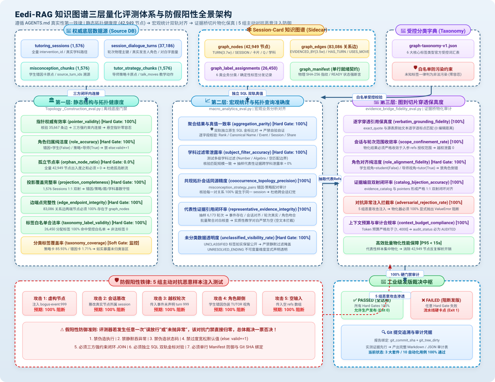

# Eedi-RAG 知识图谱三层量化评测体系与防假阳性权威说明书

> **文件版本**: `v1.0-frozen`  
> **生效范围**: `E:\PIAgent\10-projects\AgentLearn\Eedi-RAG\evals\graph`  
> **最高准则**: 严格遵循 `AGENTS.md` 工程诚实第一铁律与真实性规范。严禁任何 AI Agent 或后续开发者擅自放宽阈值、弱化校验或修改指标语义。所有度量必须基于底层真实数据库与物理哈希，杜绝任何假阳性（False Positive）。

---

## 目录
1. [评测体系总览与三层架构](#一-评测体系总览与三层架构)
2. [第一层：静态图谱结构与拓扑健康度指标](#二-第一层静态图谱结构与拓扑健康度指标)
3. [第二层：宏观统计与拓扑查询准确度指标](#三-第二层宏观统计与拓扑查询准确度指标)
4. [第四层：图到切片的穿透保真度指标](#四-第三层图到切片的穿透保真度指标)
5. [评测防假阳性七大铁律（永久冻结）](#五-评测防假阳性七大铁律永久冻结)
6. [发布门禁与发布裁决标准](#六-发布门禁与发布裁决标准)

---

## 一、 评测体系总览与三层架构

Eedi-RAG 图谱并非单纯的实体可视化网络，而是承载**宏观教学分析（Macro Analytics）**与**微观切片证据物化（Evidence Bridge）**的确定性业务骨架。

为保障流水线杜绝“假阳性欺骗”并达到工业级可靠性，评测体系采用硬件中控级全景架构设计，涵盖三层垂直量化评测套件、独立数据资产总线、主动对抗防御中枢与发版审计控制台：

### 全景架构中枢与数据总线导读

| 架构层级 / 中枢容器 | 核心职责 | 评测套件入口 | 门禁标准 |
| :--- | :--- | :--- | :--- |
| **底层数据资产总线 (Data Assets)** | 源数据库、图谱数据库、受控分类词表双轨并行，保证只读、无状态与 SHA-256 强校验 | [`tutoring_knowledge.duckdb`](file:///E:/PIAgent/10-projects/AgentLearn/Eedi-RAG/data/db/tutoring_knowledge.duckdb) [`graph-taxonomy-verify-2.duckdb`](file:///E:/PIAgent/10-projects/AgentLearn/Eedi-RAG/reports/staging/session-card-graph-v1/graph-taxonomy-verify-2-20260908.duckdb) [`graph-taxonomy-v1.json`](file:///E:/PIAgent/10-projects/AgentLearn/Eedi-RAG/data/business/graph-taxonomy-v1.json) | 源库 SHA-256 锁定 |
| **Layer 1: 静态图谱结构与拓扑健康度** | 校验图结构合规性、指针引用合法性、角色纯洁度与孤立节点 | [`Topology _Construction_eval.py`](file:///E:/PIAgent/10-projects/AgentLearn/Eedi-RAG/evals/graph/Topology%20_Construction_eval.py) | 5 大 Hard Gates 100% |
| **Layer 2: 宏观统计与拓扑查询准确度** | 校验宏观统计聚合、学科隔离、共现拓扑同源性与代表证据闭环 | [`macro_analytics_eval.py`](file:///E:/PIAgent/10-projects/AgentLearn/Eedi-RAG/evals/graph/macro_analytics_eval.py) | 5 大 Hard Gates 100% |
| **Layer 3: 图到切片的穿透保真度** | 校验图到会话切片物化的逐字一致性、会话纯洁度与双射编目 | [`evidence_bridge_fidelity_eval.py`](file:///E:/PIAgent/10-projects/AgentLearn/Eedi-RAG/evals/graph/evidence_bridge_fidelity_eval.py) | 6 大 Hard Gates 100% |
| **对抗恶意注入防御中枢** | 主动注入 5 大恶意穿透攻击（跨会话投毒、虚构节点、格式畸变等），验证系统 100% 阻断与告警能力 | 包含于 Layer 3 动态验证集 | 拦截率 100% (Hard Gate) |
| **发版决策与审计中枢** | 汇聚 3 大套件共 16 项硬门禁，结合 Git 提交哈希与工作区纯洁度，裁决 `PASSED` 或 `FAILED` | 产出 Markdown / JSON 权威审计报告 | 零豁免全绿方可发版 |

---

## 二、 第一层：静态图谱结构与拓扑健康度指标

对应脚本: [`Topology _Construction_eval.py`](file:///E:/PIAgent/10-projects/AgentLearn/Eedi-RAG/evals/graph/Topology%20_Construction_eval.py)

### 1. 指针权威有效率 (`pointer_validity`)
- **定义**: 图谱中全量 `EVIDENCED_BY` 关系边指向的 `(intervention_id, turn_id)`，必须 100% 存在于底层对话源表 `session_dialogue_turns`。
- **门禁性质**: **Hard Gate** (硬门禁)。
- **通过阈值**: `>= 1.0 (100.0000%)`。
- **度量口径**:
  $$\text{pointer\_validity} = \frac{\text{真实存在于源表且图内双向节点均合法的证据边数}}{\text{全量 EVIDENCED\_BY 边总数}}$$
- **防假阳性要求**: 严禁仅靠截取字符串去源表核验；必须同时校验 `source_node` 与 `target_node` 真实存在于 `graph_nodes`，且 `target_node.node_type == 'TURN'`。

### 2. 角色归属纯洁度 (`role_accuracy`)
- **定义**: 错因卡事件 (`MISCONCEPTION_EVENT`) 的证据边必须 100% 指向学生发言；策略卡事件 (`TUTOR_STRATEGY_EVENT`) 的证据边必须 100% 指向导师发言。
- **门禁性质**: **Hard Gate**。
- **通过阈值**: `>= 1.0 (100.0000%)`。
- **度量口径**:
  $$\text{role\_accuracy} = \frac{\text{角色完全符合定义的合法证据边数}}{\text{需核验角色属性的证据边总数}}$$
- **防假阳性要求**: 严禁依赖前缀字符串探测；必须关联 `graph_nodes.node_type` 与源表 `is_tutor` 权威字段。严禁使用 `else: valid += 1`，未识别边一律判为非法。

### 3. 孤立节点率 (`orphan_node_ratio`)
- **定义**: 图谱全量节点中，出度与入度之和为 0 的孤立无连接节点占比。
- **门禁性质**: **Hard Gate**。
- **通过阈值**: `<= 0.0 (0.0000%)`。
- **度量口径**:
  $$\text{orphan\_node\_ratio} = \frac{\text{入度为 0 且出度为 0 的节点数}}{\text{全量节点数}}$$

### 4. 分类标签覆盖率与合法率 (`taxonomy_coverage` & `taxonomy_validity`)
- **定义**:
  - `taxonomy_validity`: 图中打上的标签必须 100% 属于受控字典 [`graph-taxonomy-v1.json`](file:///E:/PIAgent/10-projects/AgentLearn/Eedi-RAG/data/taxonomy/graph-taxonomy-v1.json) 白名单（Hard Gate）。
  - `taxonomy_coverage`: 核心教研卡片（错因+策略）被赋予标准有效业务标签（非 `UNCLASSIFIED`）的比例（监控演进指标）。
- **门禁性质**: `validity` 为 **Hard Gate (100%)**；`coverage` 为 Soft Gate（如实披露覆盖率，当前基线 MISCONCEPTION 约 1.71%、STRATEGY 约 85.93%）。

### 5. 构图确定性哈希一致率 (`reproducibility_hash_match`)
- **定义**: 数据源底层文件物理 SHA-256 与 `graph_manifest` 中记录的源哈希完全一致，且实际节点数、边数与清单一致，构建状态为 `READY`。
- **门禁性质**: **Hard Gate**。
- **通过阈值**: `== 1.0` (4项核验全部通过)。

---

## 三、 第二层：宏观统计与拓扑查询准确度指标

对应脚本: [`macro_analytics_eval.py`](file:///E:/PIAgent/10-projects/AgentLearn/Eedi-RAG/evals/graph/macro_analytics_eval.py)

### 1. 聚合结果与真值一致率 (`aggregation_parity`)
- **定义**: `GraphAnalytics` 产出的 Top-K 聚合指标，与评测器直接在底层只读库上执行**独立原生 SQL 金标计算引擎**产出的结果完全一致。
- **门禁性质**: **Hard Gate**。
- **通过阈值**: `== 1.0 (100.0000%)`。
- **比对字段**: 每一行的 `rank`, `canonical_name`, `distinct_session_count`, `event_count`, `session_share` 必须 100% 吻合（浮点容差 `1e-6`）。
- **防假阳性要求**: 评测器严禁复用 `src/graph_analytics.py` 的 SQL 代码，必须使用独立重写的双轨金标 SQL 对验。

### 2. 学科过滤纯洁度与零泄露率 (`subject_filter_accuracy`)
- **定义**: 当传入学科过滤条件（如 `["Number"]` 或 `["Algebra"]`）时：
  1. 返回的 `DataScope.matched_sessions` 必须与源数据库真实属于该学科的 session 数绝对一致；
  2. 返回的 `representative_refs` 中，所有 session 的 `subject_path` 必须 100% 包含指定关键词，越界泄露率必须为 0。
- **门禁性质**: **Hard Gate**。
- **通过阈值**: `== 1.0 (100.0000%)`。

### 3. 共现拓扑会话同源精度 (`cooccurrence_topology_precision`)
- **定义**: 针对 `misconception_strategy_pairs` 操作，返回的每一对 `(misconception, tutor_strategy)` 必须真实诞生于**同一个会话 (`source_session_id`)** 中，严禁发生跨会话错因与策略的伪共现。
- **门禁性质**: **Hard Gate**。
- **通过阈值**: `== 1.0 (100.0000%)`。

### 4. 代表性证据引用闭环率 (`representative_evidence_integrity`)
- **定义**: 宏观聚合结果中抽取的 `RepresentativeEvidenceRef`，必须同时满足：
  1. `source_event_id` 在 `graph_nodes` 中真实存在且类型合法；
  2. `session_id` 与 `source_event_id` 所属会话严格一致；
  3. `turn_ids` 属于该事件且在源对话表中真实存在；
  4. 说话人角色与声明的 `perspective` (STUDENT/TUTOR) 100% 一致。
- **门禁性质**: **Hard Gate**。
- **通过阈值**: `== 1.0 (100.0000%)`。

### 5. 未分类数据透明度 (`unclassified_visibility_rate`)
- **定义**: 当底层存在未归类标签 (`UNCLASSIFIED`) 或存在业务不可度量维度（如 `UNRESOLVED_ENDING`）时，系统必须在结果中明确保留并公开披露，禁止静默过滤。
- **门禁性质**: **Hard Gate**。
- **通过阈值**: `== 1.0 (100.0000%)`。

---

## 四、 第三层：图到切片的穿透保真度指标

对应脚本: [`evidence_bridge_fidelity_eval.py`](file:///E:/PIAgent/10-projects/AgentLearn/Eedi-RAG/evals/graph/evidence_bridge_fidelity_eval.py)

### 1. 逐字穿透引用保真度 (`verbatim_grounding_fidelity`)
- **定义**: 物化输出的 `EvidencePointer.exact_quote` 必须与底层源表 `session_dialogue_turns.text` 逐字逐标点 100% 完全相同。
- **门禁性质**: **Hard Gate**。
- **通过阈值**: `== 1.0 (100.0000%)`。
- **防假阳性要求**: 逐字符匹配，任何大小写改变、标点丢失、空格变形或文本截断均判为失败。

### 2. 会话与轮次范围收敛率 (`scope_confinement_rate`)
- **定义**: 物化产物 `bundle.pointers` 与 `selected_parent_session_ids` 中的所有 `(session_id, turn_id)`，必须 100% 收敛于入参 `refs` 所授权的范围之内，严禁产生跨会话越权证据。
- **门禁性质**: **Hard Gate**。
- **通过阈值**: `== 1.0 (100.0000%)`。

### 3. 角色对齐纯洁度 (`role_alignment_fidelity`)
- **定义**: 物化后的证据，学生视角 (`perspective="STUDENT"`) 下底层轮次必须 `is_tutor == False` 且 `speaker == "student"`；导师视角必须 `is_tutor == True` 且 `speaker == "tutor"`。
- **门禁性质**: **Hard Gate**。
- **通过阈值**: `== 1.0 (100.0000%)`。

### 4. 证据编目双射闭环率 (`catalog_bijection_accuracy`)
- **定义**: `bundle.evidence_catalog` 与 `bundle.pointers` 之间必须形成严格的双射映射（Bijective Mapping）：
  - 数量完全一致；
  - 每一个 `EvidencePointer.evidence_id` 在编目字典中唯一对应且字段一致；
  - 编目字典中无任何悬空幽灵项。
- **门禁性质**: **Hard Gate**。
- **通过阈值**: `== 1.0 (100.0000%)`。

### 5. 对抗异常注入拦截率 (`adversarial_rejection_rate`)
- **定义**: 评测套件主动构造以下 5 组对抗攻击样本，物化器必须 **100% 显式抛出异常（如 `ValueError`）予以坚决拦截**：
  1. **恶意样本 1 (Bogus Event)**: 伪造不存在的图节点 ID（如 `bogus-event:999`）；
  2. **恶意样本 2 (Session Tampering)**: 节点存在但篡改 `session_id` 与节点实际会话不符；
  3. **恶意样本 3 (Unauthorized Turn)**: 传入未经该教研事件声明的越界轮次（如事件只含轮次 1，传入轮次 99）；
  4. **恶意样本 4 (Role Inversion)**: 角色颠倒穿透（错因事件声明为导师视角或策略事件声明为学生视角）；
  5. **恶意样本 5 (Empty Input)**: 传入空引用集合。
- **门禁性质**: **Hard Gate**。
- **通过阈值**: `== 1.0 (5项攻击全部成功拦截)`。
- **防假阳性要求**: 只要有任意一个恶意样本被误放行或未抛出异常，该指标直接为 0 并判定全量失败！

### 6. 上下文预算与审计合规率 (`context_budget_compliance`)
- **定义**: 物化组装的上下文 Token 数必须满足 `1 <= generator_context_token_count <= 4000`，且审计状态字段必须严格等于 `"AUDITED_100_VERIFIED"`。
- **门禁性质**: **Hard Gate**。
- **通过阈值**: `== 1.0 (100.0000%)`。

---

## 五、 评测防假阳性七大铁律（永久冻结）

所有编写或修改 Eedi-RAG 评测代码的 Agent 与工程师，必须无条件遵守以下 7 项工程铁律：

1. **三方闭环内连接铁律 (Bi-directional Closed Join)**:  
   核验图与源表关系时，必须同时内连接源节点、目标节点与源数据库物理行，严禁单侧校验或字符串前缀猜测。
2. **闭合失败铁律 (Fail-Closed Enforcement)**:  
   严禁在任何评测分支中编写宽松放行逻辑（如 `else: valid += 1` 或 `try...except: pass`）。所有未识别类型与未预期数据，默认判定为严重违规。
3. **独立金标双算铁律 (Independent Ground-Truth Dual-Run)**:  
   宏观与业务层评测必须构建独立的只读 SQL 金标引擎，与被测业务逻辑双轨比对，禁止“自己跑出的结果当做真值”。
4. **对抗攻击必测铁律 (Mandatory Adversarial Suite)**:  
   任何宣称具备“安全/权威/过滤”能力的物化器与检索器，必须同时接受对抗负样本测试。只有 100% 拦截攻击，才算通过。
5. **受控词表字典铁律 (Controlled Vocabulary Whitelist)**:  
   所有分类标签必须硬绑定 `graph-taxonomy-v1.json` 白名单，非受控词即为污染。
6. **防御式元数据单行断言 (Defensive Metadata Assertion)**:  
   连接 `graph_manifest` 等元数据表时，强制断言 `COUNT(*) == 1` 且状态为 `READY`，杜绝历史脏记录干扰。
7. **Git 提交溯源纪律 (Commit-Level Reproducibility)**:  
   所有评测报告头部必须自动采集当前的 `git_commit_sha` 与 `git_tree_dirty_status`，未提交代码输出的报告不具备发布效力。

---

## 六、 发布门禁与发布裁决标准

### 全局发布裁决逻辑
- **`PASSED` (发布通过)**: 所有声明为 **Hard Gate** 的指标实测值 100% 达标，无任何硬门禁失败。
- **`FAILED` (发版阻断)**: 任意一个 Hard Gate 指标未达标，进程以退出码 `1` 退出，CI/CD 流水线直接阻断。
- **`DEGRADED` (降级运行)**: 硬门禁全过，但监控型 Soft Gate（如部分冷门分类标签覆盖率）处于演进爬坡期，报告中必须以显式 `WARNING` 披露盲区范围，不可伪装为完美状态。

---
*本说明书由工程审计协议固化，未经技术评审严禁任何单方面修改。*

---

## 附录 A：去 Gold 化整改记录（2026-09-10）

### 背景

审计发现 `src/business_graph_pipeline.py` 中存在 11 处**以基准用例措辞作为运行时分支条件**的代码。典型形态是 Gold 查询模板把类别 slug 内嵌进查询文本（如 `围绕真实题目"…"进行mixed misconception intervention分析。`），而流水线直接匹配该 slug。这属于"对着答案调参"，不违反 AGENTS.md 的禁伪造数据条款，但同样使指标失真。

### 整改范围与代价（同一图产物、同一配置，83 条全量）

| 分组 | 基线通过 | 去 Gold 后 |
| :--- | ---: | ---: |
| 模板式（内嵌 slug），27 条 | 96.3% | **63.0%** |
| 自然提问，56 条 | 100.0% | **96.4%** |
| **全体 83 条** | **98.8%** | **85.5%** |

硬门禁变化：`planner_exact_match` 1.0000 → 0.8916；`sql_graph_scope_confinement` 1.0000 → 0.9880；`window_coverage` / `prompt_window_coverage` / `citation_recall` / `exact_quote_match` 0.9880 → 0.9639。

### 回归归因（11 条）

- **9 条为"混合路线"用例**（`_selected_lever.index == 1`）。该 `index` 在基线上**仅由 slug 文本触发**，无任何独立可判别信号，因此去 Gold 后必然回落到 `index 2`。这是指标下滑的主因。
- **3 条为 Gold 预期无可泛化信号**：`mixed-misconception-intervention-001`、`macro-cross-session-cooccurrence-004`、`micro-question-options-reasoning-003`。经规则穷举验证，任何能救回它们的通用规则都会连带破坏其他当前通过的用例。**未新增关键词规则**——那等同于重新拟合。
- 已用通用规则成功替代的：`推理过程`、`原声/课堂证据/实录/课堂原话`、引号内嵌题目（`“`）结构判定、`tutor_query/student_query` 派生车道偏好。

### 未整改项（待办）

- `_capabilities()` 硬编码 `available=True, coverage=1.0`（`business_graph_pipeline.py`）。
- `business_graph_metrics.py` 单例路径 `"source_artifact_unchanged": True` 硬编码（数据集级为真实断言）。
- `knowledge_import.py` 期望卡 ID 由 `session_{sid}_misconception` 模板推导，而非读取权威 ID。
- `docs` 中的"16 项硬门禁"与实际硬门禁数量不一致。
- `evals/graph/Topology _Construction_eval.py::find_latest_graph_db` 按 mtime 选取候选图，未锁定图产物 SHA-256。
- **Gold 数据集本身无 dev/holdout 切分**（`split_status: UNMEASURED`），全部 83 条兼作训练与评分集。本次整改未消除该结构性问题。
